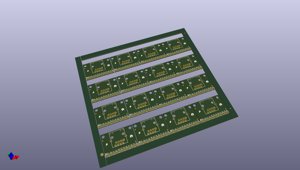
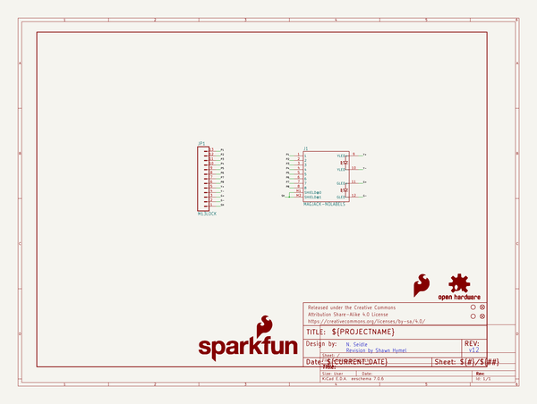

# OOMP Project  
## MagJack_Breakout  by sparkfun  
  
(snippet of original readme)  
  
SparkFun RJ45 MagJack Breakout  
================================  
  
  
  
[*SparkFun RJ45 MagJack Breakout(BOB-13021)*](https://www.sparkfun.com/products/13021)  
  
This is the SparkFun RJ45 MagJack Breakout, a simple board that will provide you with a way to put an ethernet port into your breadboard.   
  
Repository Contents  
-------------------  
* **/Fritzing** - Fritzing Example wiring images  
* **/Hardware** - All Eagle design files (.brd, .sch)  
* **/Production** - Test bed files and production panel files  
  
License Information  
-------------------  
The hardware is released under [Creative Commons ShareAlike 4.0 International](https://creativecommons.org/licenses/by-sa/4.0/).  
The code is beerware; if you see me (or any other SparkFun employee) at the local, and you've found our code helpful, please buy us a round!  
  
Distributed as-is; no warranty is given.  
  
  full source readme at [readme_src.md](readme_src.md)  
  
source repo at: [https://github.com/sparkfun/MagJack_Breakout](https://github.com/sparkfun/MagJack_Breakout)  
## Board  
  
  
## Schematic  
  
  
  
[schematic pdf](working_schematic.pdf)  
## Images  
