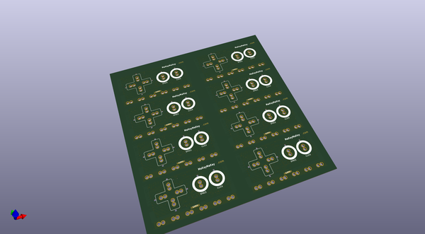
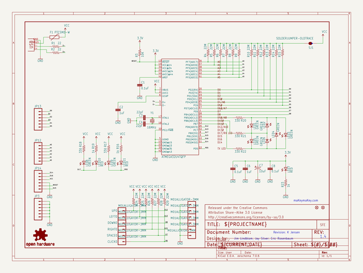
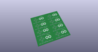
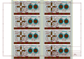
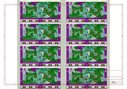
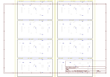
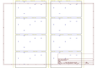
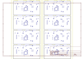
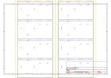

# OOMP Project  
## MaKeyMaKey  by sparkfun  
  
oomp key: oomp_projects_flat_sparkfun_makeymakey  
(snippet of original readme)  
  
**Note: Retired Product**  
===========  
  
This product has been retired from our catalog and is no longer for sale. This page is made available for those looking for datasheets and the simply curious. For the latest version of the board manufactured by JoyLabz, check out the [Makey Makey Classic by JoyLabz](https://www.sparkfun.com/products/14478).  
  
---  
  
MaKey MaKey  
===========  
  
[    
*MaKey MaKey - Standard Kit (WIG-11511)*](https://www.sparkfun.com/products/11511)  
  
Using the MaKey MaKey you can *make* anything into a *key* (get it?) just by connecting a few alligator clips. The MaKey MaKey is an invention kit that tricks your computer into thinking that almost anything is a keyboard. This allows you to hook up all kinds of fun things as an input.  
  
The MaKey MaKey uses high resistance switching to detect when you've made a connection even through materials that aren't very conductive (like leaves, pasta or people). This technique attracts noise on the input, so a moving window averager is used to lowpass the noise. The on-board ATMega32u4 communicates with your computer using the Human Interface Device (HID) protocol which means that it can act like a keyboard or mouse.  
  
Repository Contents  
-------------------  
* **/Firmware** - Example firmware files  
* **/Hardware** - All Eagle design files (.brd, .sch)  
* **/Production** - Test bed files and production panel files  
  
Documentation  
---  
  full source readme at [readme_src.md](readme_src.md)  
  
source repo at: [https://github.com/sparkfun/MaKeyMaKey](https://github.com/sparkfun/MaKeyMaKey)  
## Board  
  
  
## Schematic  
  
  
  
[schematic pdf](working_schematic.pdf)  
## Images  
  
  
  
  
  
  
  
  
  
  
  
  
  
  
  
  
