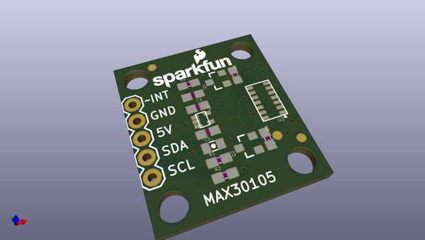
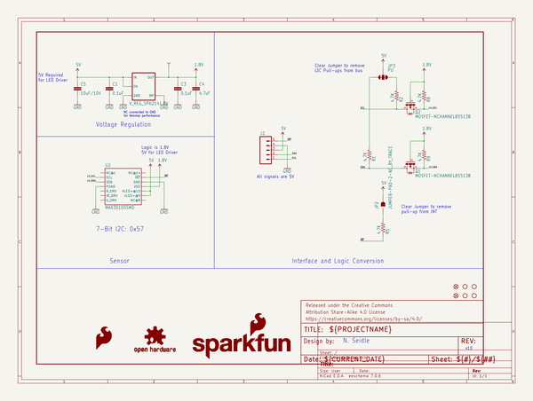
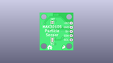
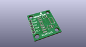
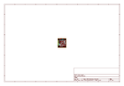
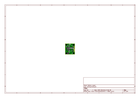
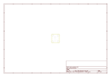
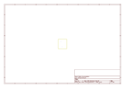
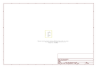

# OOMP Project  
## MAX30105_Particle_Sensor_Breakout  by sparkfun  
  
(snippet of original readme)  
  
MAX30105 Particle and Pulse Ox Sensor Breakout  
=======  
  
  
  
A breakout board for the MAX30105 Particle Sensor. This sensor uses three LEDs (Red, Green, IR) to shine different wavelengths of light at any particle in front of the photo detector. Based on the reflection the sensor outputs readings.   
  
  
  
That's my heart beat!  
  
Sensor is capable of detecting pulses but only limited algorithms are provided. It is up to the user to create the algorithms to detect different particles and/or SPO2 and/or do Pulse Detection.  
  
Board requires 3.3V to operate the IR and Red LEDs. 3.5V is recommended to operate the green LED. It has onboard voltage regulation and BSS138 MOSFETs to convert from larger logic voltages (5V) down to the needed 1.8V.  
  
License Information  
-------------------  
  
The hardware is released under [Creative Commons Share-alike 4.0](http://creativecommons.org/licenses/by-sa/4.0/).    
The firmware is released under the [Beerware license](http://en.wikipedia.org/wiki/Beerware).  
  full source readme at [readme_src.md](readme_src.md)  
  
source repo at: [https://github.com/sparkfun/MAX30105_Particle_Sensor_Breakout](https://github.com/sparkfun/MAX30105_Particle_Sensor_Breakout)  
## Board  
  
  
## Schematic  
  
  
  
[schematic pdf](working_schematic.pdf)  
## Images  
  
  
  
  
  
  
  
  
  
  
  
  
  
  
  
  
