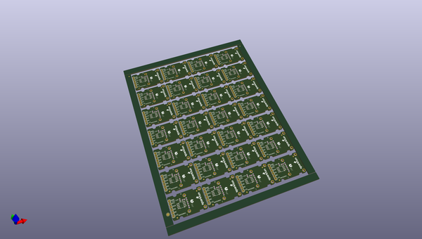
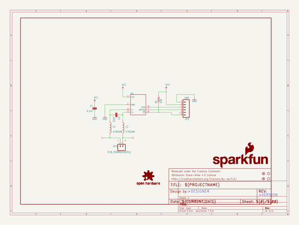

# OOMP Project  
## MAX31855K_Thermocouple_Breakout  by sparkfun  
  
oomp key: oomp_projects_flat_sparkfun_max31855k_thermocouple_breakout  
(snippet of original readme)  
  
MAX31855K Thermocouple Breakout  
========================================  
  
  
  
[*SEN-13266*](https://www.sparkfun.com/products/13266)  
  
The [MAX31855K](http://datasheets.maximintegrated.com/en/ds/MAX31855.pdf) IC takes a standard k-type thermocouple in one end, digitizes the temperature measured and sends that data out the other end via [SPI](http://en.wikipedia.org/wiki/Serial_Peripheral_Interface_Bus).  
  
This part was created in Eagle v7.2.0.  
  
  
Repository Contents  
-------------------  
  
* **/Hardware** - All Eagle design files (.brd, .sch)  
* **/Libraries** - All Arduino libraries and board examples  
* **/Production** - Test bed files and production panel files  
* **LICENSE.md** - The license this library is distributed under.  
* **README.md** - This file!  
  
Documentation  
--------------  
  
* **[Installing an Arduino Library Guide](https://learn.sparkfun.com/tutorials/installing-an-arduino-library)** - Basic information on how to install an Arduino library.  
* **[Hookup Guide](https://learn.sparkfun.com/tutorials/max31855k-thermocouple-breakout-hookup-guide)** - Basic hookup guide for the MAX31855K Thermocouple Breakout.  
  
Product Versions  
----------------  
* [*SEN-13266*](https://www.sparkfun.com/products/13266) - K-type thermocouple digitizer breakout board  
  
Version History  
---------------  
* [v1.0](https://www.spa  
  full source readme at [readme_src.md](readme_src.md)  
  
source repo at: [https://github.com/sparkfun/MAX31855K_Thermocouple_Breakout](https://github.com/sparkfun/MAX31855K_Thermocouple_Breakout)  
## Board  
  
  
## Schematic  
  
  
  
[schematic pdf](working_schematic.pdf)  
## Images  
  
  
  
  
  
  
  
  
  
  
  
  
  
  
  
  
