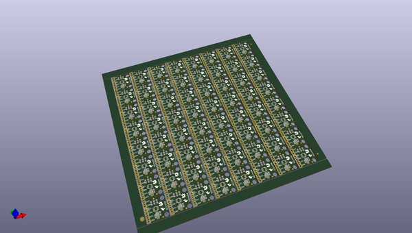
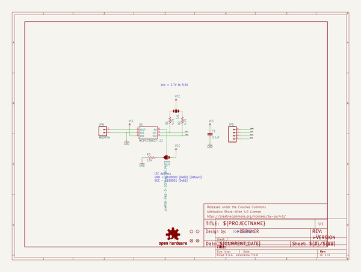
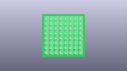
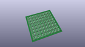
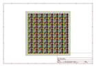
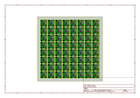
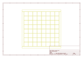
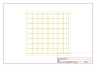
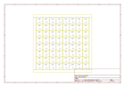

# OOMP Project  
## MCP4725_Breakout  by sparkfun  
  
(snippet of original readme)  
  
MCP4725_Breakout  
================  
[    
*Breakout Board for MCP4725 I2C DAC (BOB-12918)*](https://www.sparkfun.com/products/12918)  
  
The MCP4725 is an I2C controlled Digital-to-Analog converter (DAC). It allows you to send an analog signal from a digital source.  
  
Repository Contents  
-------------------  
* **/Hardware** - Eagle PCB layout files  
* **/Production** - Test bed files and production panel files  
  
Version History  
---------------  
* [BOB-08736](https://www.sparkfun.com/products/8736) -Version 1.3. Now retired.   
  
License Information  
-------------------  
The hardware is released under [Creative Commons ShareAlike 4.0 International](https://creativecommons.org/licenses/by-sa/4.0/).  
The code is beerware; if you see me (or any other SparkFun employee) at the local, and you've found our code helpful, please buy us a round!  
  
Distributed as-is; no warranty is given.  
  
  full source readme at [readme_src.md](readme_src.md)  
  
source repo at: [https://github.com/sparkfun/MCP4725_Breakout](https://github.com/sparkfun/MCP4725_Breakout)  
## Board  
  
  
## Schematic  
  
  
  
[schematic pdf](working_schematic.pdf)  
## Images  
  
  
  
  
  
  
  
  
  
  
  
  
  
  
  
  
