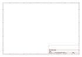
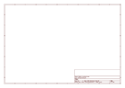

# OOMP Project  
## Mega_Pro  by sparkfun  
  
oomp key: oomp_projects_flat_sparkfun_mega_pro  
(snippet of original readme)  
  
**NOTE:** *This product has been retired from our catalog. If you are looking for more up-to-date info, please check out some of these resources to see how other users are still hacking and improving on this product.*  
* *[SparkFun Forum](https://forum.sparkfun.com/)*  
* *[Comments Here on GitHub](https://github.com/sparkfun/Mega_Pro/issues)*  
* *[IRC Channel](https://www.sparkfun.com/news/263)*  
  
Mega Pro  
=============  
  
[  
*Mega Pro(DEV-11007)*](https://www.sparkfun.com/products/11007)  
  
This is a microcontroller board running a version of the STK500V2 bootloader. This board connects directly to the FTDI  
basic breakout board and supports auto-reset. The DC power jack footprint is available but not populated.   
  
This board has the same pin configuration as the Arduino Mega.   
  
  
Repository Contents  
-------------------  
* **/Hardware** - All Eagle design files (.brd, .sch)  
* **/Production** - Test bed files and production panel files  
  
  
Product Versions  
----------------  
* [DEV-10744](https://www.sparkfun.com/products/10744)- 3.3V/8MHz version  
* [DEV-11007](https://www.sparkfun.com/products/11007)- 5V/16MHz version  
  
License Information  
-------------------  
The hardware is released under [Creative Commons ShareAlike 4.0 International](https://creativecommons.org/licenses/by-sa/4.0/).  
The code is beerware; if you see me (or any other SparkFun employee) at the local, and you've found our code helpful, please buy us a rou  
  full source readme at [readme_src.md](readme_src.md)  
  
source repo at: [https://github.com/sparkfun/Mega_Pro](https://github.com/sparkfun/Mega_Pro)  
## Board  
  
  
## Schematic  
  
  
  
[schematic pdf](working_schematic.pdf)  
## Images  
  
  
  
  
  
  
  
  
  
  
  
  
  
  
  
  
