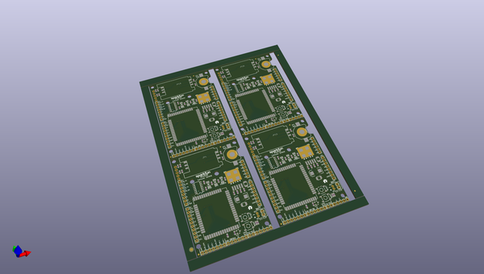
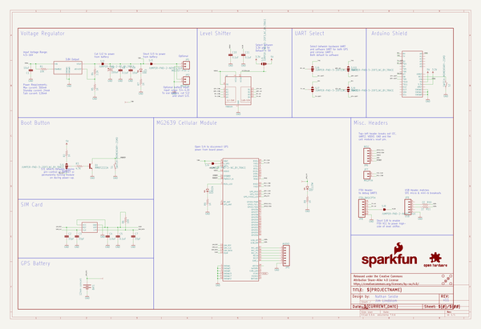

# OOMP Project  
## MG2639_Cellular_Shield  by sparkfun  
  
oomp key: oomp_projects_flat_sparkfun_mg2639_cellular_shield  
(snippet of original readme)  
  
**Note:Retired Product**  
This product has been retired from our catalog and is no longer for sale. This page is made available for those looking for datasheets and the simply curious.  
  
SparkFun MG2639 Cellular Shield  
=========================  
  
  
  
[*SparkFun MG2639 Cellular Shield (CEL-13120)*](https://www.sparkfun.com/products/13120)  
  
The SparkFun MG2639 Cellular shield is an Arduino compatible shield that gives the user access to the MG2639_V3 GSM+GPS module. The module is capable of accquiring a GPS location as well as communication with GSM networks all over the world. Phonecalls can be made, texts sent, and data pushed to and read from web pages. All the supporting circuitry is provided including translation from 2.8V of the module to a user selectable 3.3V or 5V.  
  
The main interface is two software serial ports.  
  
Power can be provided either from the Arduino board's VIN or from an external battery such as a lithium polymer.  
  
Repository Contents  
-------------------  
  
* **/Firmware** - Example sketches that work without the Arduino library.  
* **/Hardware** - Schematic and PCB layout for the shield. Also includes an eagle library containing the various custom footprints for this shield. Specifically the MG2639 footprint.  
* **/Documentation** - The AT command set, hardware guide, and various other datasheets.  
* **/Libr  
  full source readme at [readme_src.md](readme_src.md)  
  
source repo at: [https://github.com/sparkfun/MG2639_Cellular_Shield](https://github.com/sparkfun/MG2639_Cellular_Shield)  
## Board  
  
  
## Schematic  
  
  
  
[schematic pdf](working_schematic.pdf)  
## Images  
  
  
  
  
  
  
  
  
  
  
  
  
  
  
  
  
