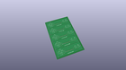
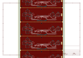
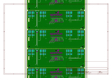
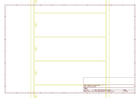
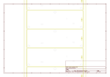
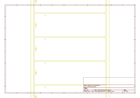
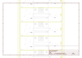

# OOMP Project  
## Micro_Bit_Controller_Bit  by sparkfun  
  
oomp key: oomp_projects_flat_sparkfun_micro_bit_controller_bit  
(snippet of original readme)  
  
SparkFun controller:bit - micro:bit Carrier Board (Qwiic)  
========================================  
  
<table class="table table-hover table-striped table-bordered">  
  <tr align="center">  
   <td></td>  
   <td></td>  
  </tr>  
  <tr align="center">  
   <td><i>SparkFun controller:bit - micro:bit Carrier Board (Qwiic)  [ <a href="https://www.sparkfun.com/products/16129">DEV-16129</a> ]</i></td>  
   <td><i>SparkFun micro:arcade kit for micro:bit v2.0  [ <a href="https://www.sparkfun.com/products/16403">KIT-16403</a> ]</i></td>  
  </tr>  
</table>  
  
  
The SparkFun controller:bit is a fun-filled “carrier” board for the micro:bit that, when combined with the micro:bit, provides you with a fully functional game system. Designed in a similar form factor to the classic Nintendo NES controller, the controller:bit is equipped with a four-direction “D-pad” on the left side of the board and two action buttons on the right side of the board. The two push buttons on the micro:bit in the center function as start and select. The back  
  full source readme at [readme_src.md](readme_src.md)  
  
source repo at: [https://github.com/sparkfun/Micro_Bit_Controller_Bit](https://github.com/sparkfun/Micro_Bit_Controller_Bit)  
## Board  
  
  
## Schematic  
  
  
  
[schematic pdf](working_schematic.pdf)  
## Images  
  
  
  
  
  
  
  
  
  
  
  
  
  
  
  
  
