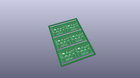
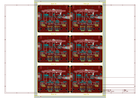
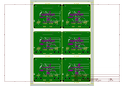
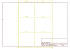
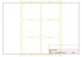
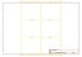
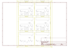

# OOMP Project  
## Micro_Bit_Weather_Bit  by sparkfun  
  
oomp key: oomp_projects_flat_sparkfun_micro_bit_weather_bit  
(snippet of original readme)  
  
SparkFun weather:bit - micro:bit Carrier Board (Qwiic)  
========================================  
  
  
  
[*SparkFun weather:bit (DEV-15837)*](https://www.sparkfun.com/products/15837)  
  
The SparkFun weather:bit is a fully loaded “carrier” board for the micro:bit that, when combined with the micro:bit, provides you with a fully functional weather station. With the weather:bit you will have access to barometric pressure, relative humidity and temperature readings. There are also connections on this carrier board to optional sensors such as wind speed, direction, rain gauge and soil readings! The micro:bit has a lot of features and a lot of potential for weather data collection.  
  
Repository Contents  
-------------------  
  
* **/Firmware** -  Example code used in the micro:climate Kit Experiment Guide. While they are compiled HEX codes, you can modify the example code once they are imported into MakeCode editor.  
* **/Hardware** - Eagle design files (.brd, .sch)  
* **/Production** - Production panel files (.brd)  
  
Documentation  
--------------  
* **[Library](https://github.com/sparkfun/pxt-weather-bit)** - PXT weather:bit firmware  
* **[micro:Climate Kit Experiment Guide](https://learn.sparkfun.com/tutorials/microclimate-kit-experiment-guide)** - Experiment guide using the weather:bit carrier board.  
* **[Wireless Re  
  full source readme at [readme_src.md](readme_src.md)  
  
source repo at: [https://github.com/sparkfun/Micro_Bit_Weather_Bit](https://github.com/sparkfun/Micro_Bit_Weather_Bit)  
## Board  
  
  
## Schematic  
  
  
  
[schematic pdf](working_schematic.pdf)  
## Images  
  
  
  
  
  
  
  
  
  
  
  
  
  
  
  
  
