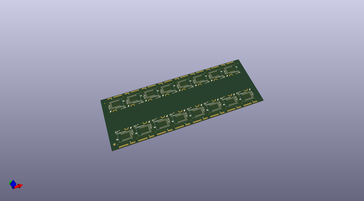
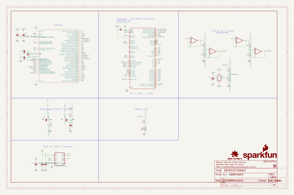

# OOMP Project  
## MicroMod_Artemis_Processor  by sparkfun  
  
oomp key: oomp_projects_flat_sparkfun_micromod_artemis_processor  
(snippet of original readme)  
  
SparkFun MicroMod Artemis Processor Board  
========================================  
  
  
  
[*SparkFun MicroMod Artemis Processor Board (16401)*](https://www.sparkfun.com/products/16401)  
  
Leveraging the ultra powerful Artemis Module, the SparkFun MicroMod Artemis Processor is the brain board of your dreams. Need Machine Learning capabilities? We gotcha. Need Bluetooth? We gotcha. Need I2C functionality to connect to all our amazing Qwiic boards? We totally gotcha.    
  
At the heart of SparkFun's Artemis module is Ambiq Micro's Apollo3 processor, whose ultra-efficient ARM Cortex-M4F processor is spec’d to run TensorFlow Lite using only 6uA/MHz. We've routed 2 I2C buses, 8 GPIO, dedicated digital, analog, and PWM pins, multiple SPI as well as QuadSPI, and Bluetooth to boot. You really can't go wrong with this processor. Grab one today, pick up a compatible carrier board, and get hacking!   
  
  
Repository Contents  
-------------------  
  
* **/Hardware** - Eagle design files (.brd, .sch)  
* **/TestSketches** - Related software for the MicroMod Artemis Processor Board  
  
Documentation  
--------------  
* **[Hookup Guide](https://learn.sparkfun.com/tutorials/micromod-artemis-processor-board-hookup-guide)** - Basic hookup guide for the MicroMod Artemis Processor Board.  
* **[Getting Started with MicroMod](https://learn.sparkfun.com/tutorials/  
  full source readme at [readme_src.md](readme_src.md)  
  
source repo at: [https://github.com/sparkfun/MicroMod_Artemis_Processor](https://github.com/sparkfun/MicroMod_Artemis_Processor)  
## Board  
  
  
## Schematic  
  
  
  
[schematic pdf](working_schematic.pdf)  
## Images  
