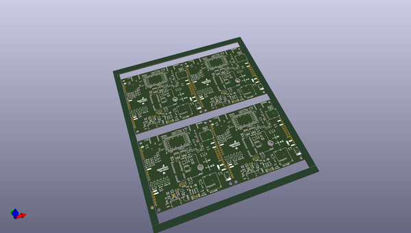

# OOMP Project  
## MicroMod_Asset_Tracker  by sparkfun  
  
oomp key: oomp_projects_flat_sparkfun_micromod_asset_tracker  
(snippet of original readme)  
  
- MicroMod Asset Tracker Carrier Board  
  
  
  
[*SparkFun MicroMod Asset Tracker Carrier Board (DEV-17272)*](https://www.sparkfun.com/products/17272)  
  
The MicroMod Asset Tracker Carrier Board provides you with a toolkit to monitor and track the location of your assets. Built around the u-blox SARA-R510M8S module, the asset tracker offers Secure Cloud LTE-M data communication for multi-regional use and has an integrated u-blox M8 GNSS receiver for accurate positioning information. The SARA-R5 supports many different forms of data communication from full TCP/IP sockets and packet switched data, through HTTP Get/Put/Post, FTP (the SARA has a built-in file system), Ping, to good old SMS text messaging!  
  
The Asset Tracker Carrier Board has an integrated ICM-20948 Inertial Measurement Unit (IMU) for Nine Degree-Of-Freedom orientation and movement detection. Want to send a message if your asset is moved? The Asset Tracker can do that! The board also has a built-in digital microphone and so can send an alert as soon as a noise is detected too.  
  
The SparkFun Asset Tracker Carrier Board also has a built-in micro-SD card socket for data logging. Power options include both USB-C and LiPo battery (with built-in charging and battery fuel gauge), but you can provide power via a breakout pin too.  
  
--  
  full source readme at [readme_src.md](readme_src.md)  
  
source repo at: [https://github.com/sparkfun/MicroMod_Asset_Tracker](https://github.com/sparkfun/MicroMod_Asset_Tracker)  
## Board  
  
  
## Schematic  
  
  
  
[schematic pdf](working_schematic.pdf)  
## Images  
