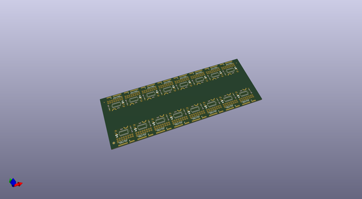
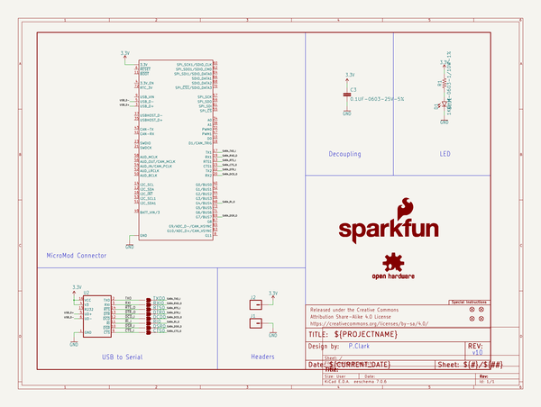
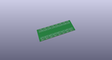
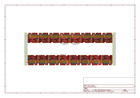
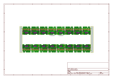
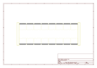
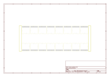
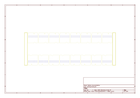

# OOMP Project  
## MicroMod_Asset_Tracker_Update_Tool  by sparkfun  
  
oomp key: oomp_projects_flat_sparkfun_micromod_asset_tracker_update_tool  
(snippet of original readme)  
  
- MicroMod Asset Tracker Firmware Update Tool  
  
  
  
[*SparkFun MicroMod Update Tool (DEV-17725)*](https://www.sparkfun.com/products/17725)  
  
A dummy Processor Board which will simplify firmware updates for the SARA-R5 on the [MicroMod Asset Tracker Carrier Board](https://www.sparkfun.com/products/17272).  
  
The board carries a CH340C USB-Serial converter to act as the bridge between the USB-C interface on the carrier board and the 8-wire UART interface on the SARA-R5.  
  
Power for the SARA can be enabled via a push-button on the carrier board.  
  
The firmware can be updated with [EasyFlash](https://www.u-blox.com/sites/default/files/SARA-R5-FW-Update_AppNote_%28UBX-20033314%29.pdf).  
  
The tool will also make it easy for anyone wanting to use [m-center](https://www.u-blox.com/en/product/m-center) to communicate with the SARA.  
  
-- Repository Contents  
  
* **/Hardware** - Eagle PCB, SCH and LBR design files  
* **LICENSE.md** contains the licence information  
  
-- Documentation  
  
* **[Hookup Guide](https://learn.sparkfun.com/tutorials/micromod-update-tool-hookup-guide)** - A basic Hookup Guide for the MicroMod Update Tool.  
* **[Getting Started with MicroMod](https://learn.sparkfun.com/tutorials/getting-started-with-micromod)** - A tutorial to help you get started with the MicroMod Ecosystem.  
* **[Designing with MicroMod](https://lea  
  full source readme at [readme_src.md](readme_src.md)  
  
source repo at: [https://github.com/sparkfun/MicroMod_Asset_Tracker_Update_Tool](https://github.com/sparkfun/MicroMod_Asset_Tracker_Update_Tool)  
## Board  
  
  
## Schematic  
  
  
  
[schematic pdf](working_schematic.pdf)  
## Images  
  
  
  
  
  
  
  
  
  
  
  
  
  
  
  
  
