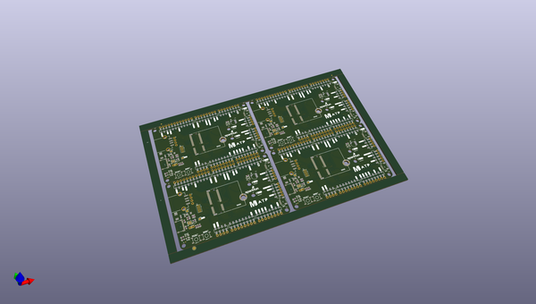
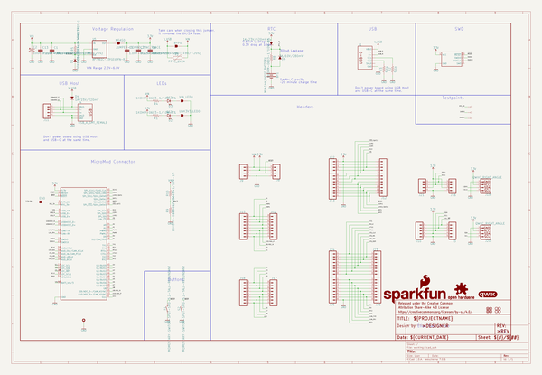
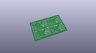
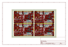
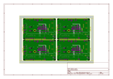
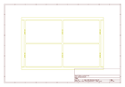
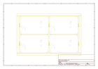
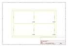
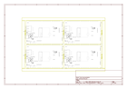

# OOMP Project  
## MicroMod_ATP_Carrier_Board  by sparkfun  
  
oomp key: oomp_projects_flat_sparkfun_micromod_atp_carrier_board  
(snippet of original readme)  
  
SparkFun MicroMod ATP Carrier Board  
========================================  
  
  
  
[*SparkFun MicroMod ATP Carrier Board (DEV-16885)*](https://www.sparkfun.com/products/16885)  
  
<Basic description of the part.>  
  
Repository Contents  
-------------------  
  
* **/Documentation** - Data sheets, additional product information  
* **/Firmware** - Example code   
* **/Hardware** - Eagle design files (.brd, .sch)  
* **/Production** - Production panel files (.brd)  
  
Documentation  
--------------  
* **[Hookup Guide](https://learn.sparkfun.com/tutorials/micromod-all-the-pins-atp-carrier-board)** - Basic hookup guide  
  
Product Versions  
----------------  
* [DEV-16885](https://www.sparkfun.com/products/16885)  
  
Version History  
---------------  
* [v1.1](https://github.com/sparkfun/MicroMod_ATP_Carrier_Board/tree/v1.1) - Initial Release   
  
License Information  
-------------------  
  
This product is _**open source**_!   
  
Please review the LICENSE.md file for license information.   
  
If you have any questions or concerns on licensing, please contact technical support on our [SparkFun forums](https://forum.sparkfun.com/viewforum.php?f=152).  
  
Distributed as-is; no warranty is given.  
  
- Your friends at SparkFun.  
  
_<COLLABORATION CREDIT>_  
  
  full source readme at [readme_src.md](readme_src.md)  
  
source repo at: [https://github.com/sparkfun/MicroMod_ATP_Carrier_Board](https://github.com/sparkfun/MicroMod_ATP_Carrier_Board)  
## Board  
  
  
## Schematic  
  
  
  
[schematic pdf](working_schematic.pdf)  
## Images  
  
  
  
  
  
  
  
  
  
  
  
  
  
  
  
  
