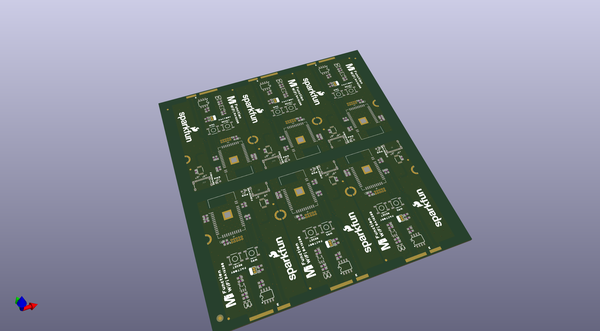
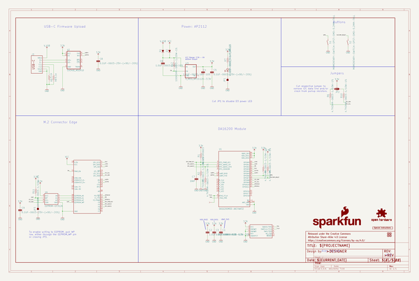
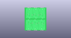
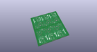
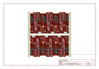
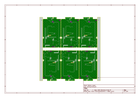
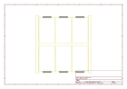
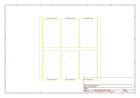
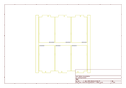
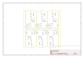

# OOMP Project  
## MicroMod_DA16200_Function  by sparkfun  
  
oomp key: oomp_projects_flat_sparkfun_micromod_da16200_function  
(snippet of original readme)  
  
SparkFun MicroMod DA16200 Function Board  
========================================  
  
  
  
[*SparkFun MicroMod DA16200 Function Board (18594)*](https://www.sparkfun.com/products/18594)  
  
The SparkFun MicroMod DA16200 Function Board adds a fully integrated WiFi module with a 40MHz crystal oscillator, 32.768KHz RTC clock, RF Lumped RF filter, 4MB flash memory, and an on-board chip antenna to any MicroMod project. With the addition of JTAG connectors for deep dive programming, you've got everything you need to get your MicroMod setup ready for your next IoT project.   
  
The SparkFun MicroMod DA16200 Function Board is ideal for MicroMod projects involving door locks, thermostats, sensors, pet trackers, and other home IoT projects, thanks in part to the multiple sleep modes that allow you to take advantage of current draws as low as 0.2uA-3.5uA.  
  
Additionally, the DA16200 module's certified WiFi alliance for IEEE802.11b/g/n, WiFi Direct, and WPS functionalities means that it has been approved for use by multiple countries and using the WiFi Alliance transfer policy, each WiFi Certification can be transferred without being tested again.   
  
Repository Contents  
-------------------  
* **/Hardware** - Eagle design files (.brd, .sch)  
  
Documentation  
--------------  
* **[Hookup Guide](https://learn.sparkfun.com/tutorials/micromod-wifi-function-board---da16200-hookup  
  full source readme at [readme_src.md](readme_src.md)  
  
source repo at: [https://github.com/sparkfun/MicroMod_DA16200_Function](https://github.com/sparkfun/MicroMod_DA16200_Function)  
## Board  
  
  
## Schematic  
  
  
  
[schematic pdf](working_schematic.pdf)  
## Images  
  
  
  
  
  
  
  
  
  
  
  
  
  
  
  
  
