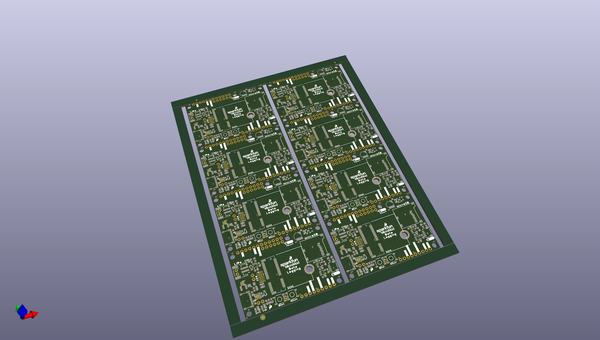
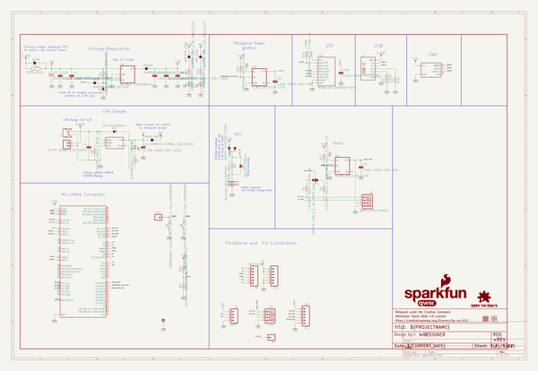
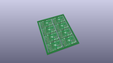
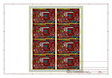
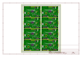
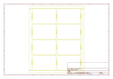
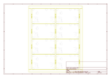
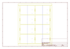
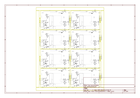

# OOMP Project  
## MicroMod_Data_Logging_Carrier  by sparkfun  
  
oomp key: oomp_projects_flat_sparkfun_micromod_data_logging_carrier  
(snippet of original readme)  
  
SparkFun MicroMod Data Logging Carrier Board  
========================================  
  
  
  
[SparkFun MicroMod Data Logging Carrier Board (DEV-16829)](https://www.sparkfun.com/products/16829)  
  
The SparkFun MicroMod Data Logging Carrier Board offers a highly customizable, low-power data logging platform using the MicroMod system allowing you to choose your own Processor Board to pair with the Carrier Board. The board features several connections for data collection including I2C, SPI and Serial UART.  
  
Repository Contents  
-------------------  
  
* **/Examples** - Arduino example sketches  
* **/Hardware** - Eagle design files (.brd, .sch)  
  
Documentation  
--------------  
* **[Hookup Guide](https://learn.sparkfun.com/tutorials/micromod-data-logging-carrier-board-hookup-guide)** - Basic hookup guide for the SparkFun MicroMod Data Logging Carrier Board  
* **[MicroMod Info Page](https://ww.sparkfun.com/micromod)** - MicroMod Information Page  
  
Version History  
---------------  
* **[DEV-16829](https://www.sparkfun.com/products/16829)** - Initial release.  
  
License Information  
-------------------  
  
This product is _**open source**_!   
  
Please review the LICENSE.md file for license information.   
  
If you have any questions or concerns on licensing, please contact technical support on our [SparkFun forums](https://forum.sparkfun.com/viewforu  
  full source readme at [readme_src.md](readme_src.md)  
  
source repo at: [https://github.com/sparkfun/MicroMod_Data_Logging_Carrier](https://github.com/sparkfun/MicroMod_Data_Logging_Carrier)  
## Board  
  
  
## Schematic  
  
  
  
[schematic pdf](working_schematic.pdf)  
## Images  
  
  
  
  
  
  
  
  
  
  
  
  
  
  
  
  
