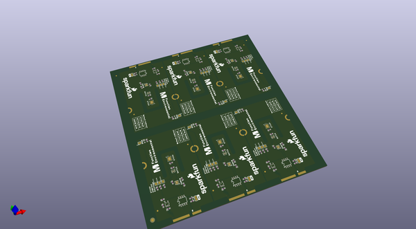
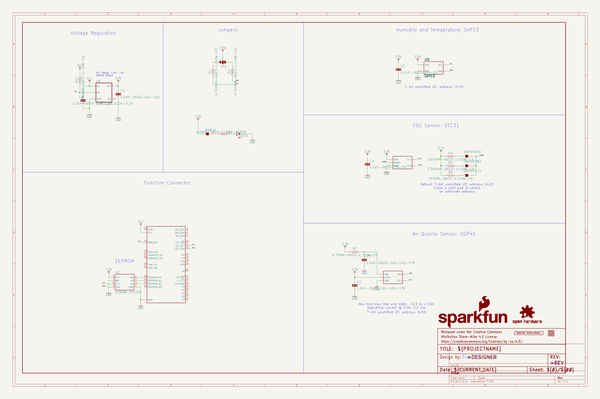

# OOMP Project  
## MicroMod_Environmental_Sensor_Function_Board  by sparkfun  
  
oomp key: oomp_projects_flat_sparkfun_micromod_environmental_sensor_function_board  
(snippet of original readme)  
  
SparkFun MicroMod Environmental Sensor Function Board  
========================================  
  
  
  
[*SparkFun MicroMod Environmental Sensor Function Board (SEN-18632)*](https://www.sparkfun.com/products/18632)  
  
The SparkFun MicroMod Environmental Function Board adds additional sensing options to the MicroMod Processor Boards. This Function Board includes three sensors to monitor air quality (SGP40), humidity & temperature (SHTC3), and CO2 concentrations (STC31) in your indoor environment. To make it even easier to use, all communication is over the MicroMod's I2C bus!  
  
* The SGP40 measures the quality of the air in your room or house. The SGP40 uses a metal oxide (MOx) sensor with a temperature controlled micro hotplate and provides a humidity-compensated volatile organic compound (VOC) based indoor air quality signal. Both the sensing element and VOC Algorithm feature an unmatched robustness against contaminating gases present in real world applications enabling a unique long term stability as well as low drift and device to device variation.  
  
* The SHTC3 is a highly accurate digital humidity and temperature sensor. The SHTC3 uses a capacitive humidity sensor with a relative humidity measurement range of 0 to 100% RH and bandgap temperature sensor wi  
  full source readme at [readme_src.md](readme_src.md)  
  
source repo at: [https://github.com/sparkfun/MicroMod_Environmental_Sensor_Function_Board](https://github.com/sparkfun/MicroMod_Environmental_Sensor_Function_Board)  
## Board  
  
  
## Schematic  
  
  
  
[schematic pdf](working_schematic.pdf)  
## Images  
