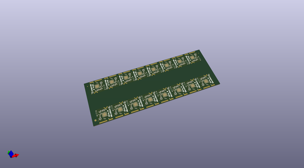
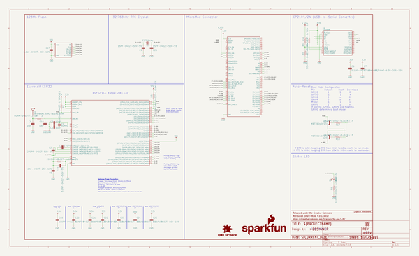
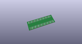
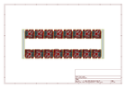
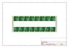
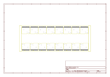
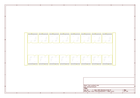
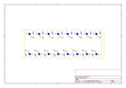
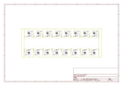

# OOMP Project  
## MicroMod_ESP32_Processor  by sparkfun  
  
(snippet of original readme)  
  
SparkFun MicroMod ESP32 Processor Board  
========================================  
  
  
  
[*SparkFun MicroMod ESP32 Processor Board (16781)*](https://www.sparkfun.com/products/16781)  
  
The MicroMod ESP32 Processor Board combines Espressif's ESP32 with our M.2 connector interface to bring a power-packed processor board into our MicroMod ecosystem.   
  
The ESP32 includes a laundry list of functionality, including the dual-core Tensilica LX6 microprocessor, 240MHz clock frequency, 520kB internal SRAM, integrated WiFi transceiver, and hardware accelerated encryption (AES, SHA2, ECC, RSA-4096). With this MicroMod processor board, you have access to 8 general use IO pins, dedicated analog, digital, and PWM pins, as well as all the fan favorites - SPI, I2C, UART, and SDIO. Add to that 16MB flash storage and sleep current of around 500&micro;A, and you've got a perfect storm of versatility.   
  
Grab yourself a SparkFun MicroMod ESP32 Processor Board and a compatible carrier board and get to hacking!   
  
Repository Contents  
-------------------  
  
* **/Documentation** - Data sheets, additional product information  
* **/Hardware** - Eagle design files (.brd, .sch)  
* **/Production** - Production panel files (.brd)  
  
Documentation  
--------------  
* **[Hookup Guide](https://learn.sparkfun.com/tutorials/micromod-esp32-p  
  full source readme at [readme_src.md](readme_src.md)  
  
source repo at: [https://github.com/sparkfun/MicroMod_ESP32_Processor](https://github.com/sparkfun/MicroMod_ESP32_Processor)  
## Board  
  
  
## Schematic  
  
  
  
[schematic pdf](working_schematic.pdf)  
## Images  
  
  
  
  
  
  
  
  
  
  
  
  
  
  
  
  
