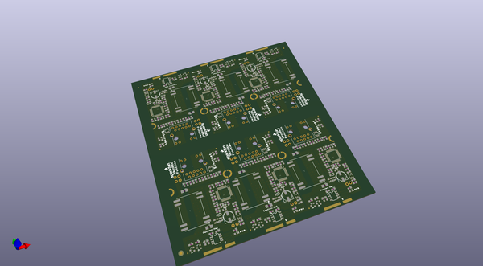
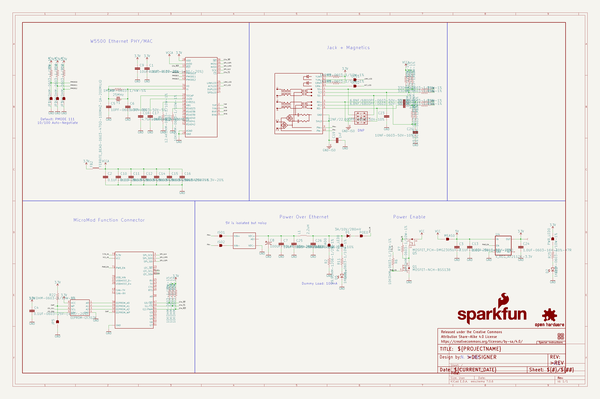
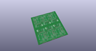
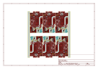
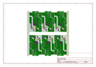
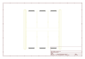
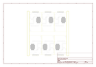
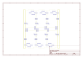
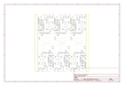

# OOMP Project  
## MicroMod_Function_Ethernet-W5500  by sparkfun  
  
(snippet of original readme)  
  
SparkFun MicroMod Ethernet Function Board - W5500  
========================================  
  
  
  
[*SparkFun MicroMod Ethernet Function Board - W5500 (COM-18708)*](https://www.sparkfun.com/products/18708)  
  
The SparkFun MicroMod Ethernet Function Board - W5500 provides Ethernet network connection as well as Power-over-Ethernet capabilities to a MicroMod project.  
  
The W5500 Ethernet Controller from WIZnet is a TCP/IP embedded Ethernet controller that uses SPI communication protocol to allow up to eight independent sockets operate simultaneously. The W5500 SPI interface operates at up to 80MHz and supports fast SPI for high speed Ethernet communication. The chip also includes a Wake on Lan (WOL) operation and power down mode to help conserve power.  
  
The board uses a Ag9900m Power-over-Ethernet (PoE) DC/DC converter module to power MicroMod assemblies from a PoE source such as a router or network switch. The DC/DC converter supplies 9 Watts @5V to connected devices. This Function Board configures the PoE supply voltage to the IEEE802.3af Alternate B power scheme. This power scheme uses the spare pairs in the Ethernet cable (4,5 and 7,8) for positive and negative DC voltage, isolating power delivery from the data lines.  
  
Repository Contents  
-------------------  
  
* **/Documents** -   
  full source readme at [readme_src.md](readme_src.md)  
  
source repo at: [https://github.com/sparkfun/MicroMod_Function_Ethernet-W5500](https://github.com/sparkfun/MicroMod_Function_Ethernet-W5500)  
## Board  
  
  
## Schematic  
  
  
  
[schematic pdf](working_schematic.pdf)  
## Images  
  
  
  
  
  
  
  
  
  
  
  
  
  
  
  
  
