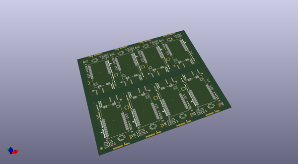

# OOMP Project  
## MicroMod_Function_LoRa_1W  by sparkfun  
  
(snippet of original readme)  
  
SparkFun MicroMod LoRa Function Board  
========================================  
  
  
  
[*SparkFun MicroMod LoRa Function Board (DEV-18573)*](https://www.sparkfun.com/products/18573)  
  
The SparkFun MicroMod LoRa Function Board provides LoRA and LoRaWAN capabilities to your MicroMod project. It is intended to be used in conjunction with a MicroMod Processor Board and a MicroMod Main Board, which provides the electrical interface between a processor board and the Function Board(s).  
  
The LoRa Function Board utilizes the 915M30S LoRa module from EBYTE, which is a 1W (30dBm) transceiver based around the SX1276 from Semtech. There is a robust edge mount RP-SMA connector for large LoRa (915MHz) antennas; with modification, a U.FL connector is also available. We've successfully tested a 12 miles line-of-sight transmission with this module (test was performed under ideal conditions; individual user results may vary).  
  
With the MicroMod standardization, users no longer need to cross-reference schematics with datasheets, while fumbling around with jumper wires. Simply, match up the function board's M.2 edge connector to the slot of the M.2 connector on the main board and secure the function board with screws.  
  
  
Repository Contents  
-------------------  
  
* **/Firmware** - Arduino example code from the tutorial  
* **/H  
  full source readme at [readme_src.md](readme_src.md)  
  
source repo at: [https://github.com/sparkfun/MicroMod_Function_LoRa_1W](https://github.com/sparkfun/MicroMod_Function_LoRa_1W)  
## Board  
  
  
## Schematic  
  
  
  
[schematic pdf](working_schematic.pdf)  
## Images  
