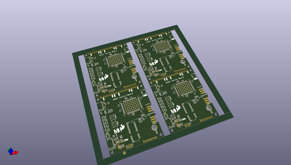
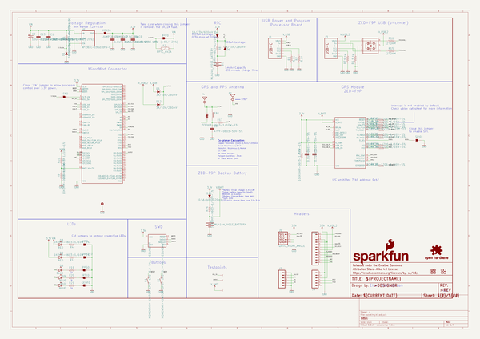
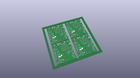
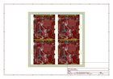
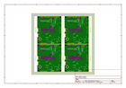
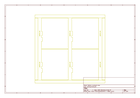
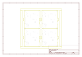
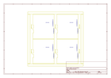
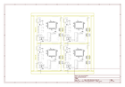

# OOMP Project  
## MicroMod_GNSS_F9P_Carrier_Board  by sparkfun  
  
oomp key: oomp_projects_flat_sparkfun_micromod_gnss_f9p_carrier_board  
(snippet of original readme)  
  
SparkFun MicroMod GNSS Carrier Board (ZED-F9P)  
========================================  
  
  
  
[*SparkFun MicroMod GNSS Carrier Board (ZED-F9P) (GPS-17722)*](https://www.sparkfun.com/products/17722)  
  
With GNSS you are able to know where you are, where you're going, and how to get there anywhere on Earth within 30 seconds. This means the higher the accuracy the better! GNSS Real Time Kinematics (RTK) has mastered dialing in the accuracy of their GNSS modules to just millimeters, and that's why we had to put it on this board! With the flexibility of the MicroMod's M.2 connector, you can easily test and swap out different MicroMod processor boards for your application. Simply match up the key on your board's beveled edge connector to the key on the M.2 connector and secure the boards with a screw.  
  
The SparkFun MicroMod GNSS Carrier Board raises the bar for high-precision GPS and is in a line of powerful RTK boards featuring the ZED-F9P module from u-blox. The ZED-F9P is a top-of-the-line module for high accuracy GNSS and GPS location solutions including RTK that is capable of 10mm, three-dimensional accuracy. With this board, you will be able to know where your (or any object's) X, Y, and Z location is within roughly the width of your fingernail! The ZED-F9P is unique in that it is ca  
  full source readme at [readme_src.md](readme_src.md)  
  
source repo at: [https://github.com/sparkfun/MicroMod_GNSS_F9P_Carrier_Board](https://github.com/sparkfun/MicroMod_GNSS_F9P_Carrier_Board)  
## Board  
  
  
## Schematic  
  
  
  
[schematic pdf](working_schematic.pdf)  
## Images  
  
  
  
  
  
  
  
  
  
  
  
  
  
  
  
  
