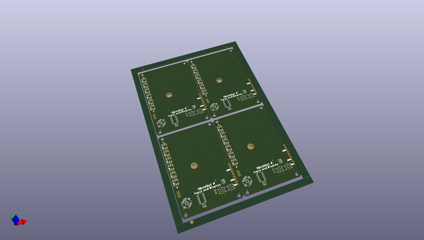

# OOMP Project  
## MicroMod_Input_and_Display_Carrier  by sparkfun  
  
oomp key: oomp_projects_flat_sparkfun_micromod_input_and_display_carrier  
(snippet of original readme)  
  
- SparkFun MicroMod Input and Display Carrier Board  
========================================  
  
  
  
[*SparkFun MicroMod Input and Display Carrier Board (16985)*](https://www.sparkfun.com/products/16985)  
  
The SparkFun MicroMod Input and Display Carrier Board is a great way to add data and input visibility to your MicroMod project. Want to create your own embedded game? How about displaying data that is remotely collected and transmitted by your SparkFun MicroMod Weather Carrier Board and its processor? This is a great option.   
  
This carrier board combines a 2.4" TFT display, 6 addressable LEDs, onboard voltage regulator, a 6 pin IO connector, and microSD slot with the M.2 pin connector slot so that it can be used with compatible processor boards in our MicroMod ecosystem.   
  
Repository Contents  
-------------------  
* **/Firmware** - Example code specific to the Input and Display Carrier Board.  
* **/Hardware** - Eagle design files (.brd, .sch)  
* **/Production** - Production panel files (.brd)  
  
Documentation  
--------------  
* **[Hookup Guide](https://learn.sparkfun.com/tutorials/sparkfun-micromod-input-and-display-carrier-board-hookup-guide)** - Basic hookup guide for the SparkFun MicroMod Input and Display Carrier Board.  
* **[SparkFun Graphical Datasheets](https://github.com/sparkfun/Graphical_Datasheets)** -Graphical Data  
  full source readme at [readme_src.md](readme_src.md)  
  
source repo at: [https://github.com/sparkfun/MicroMod_Input_and_Display_Carrier](https://github.com/sparkfun/MicroMod_Input_and_Display_Carrier)  
## Board  
  
  
## Schematic  
  
  
  
[schematic pdf](working_schematic.pdf)  
## Images  
