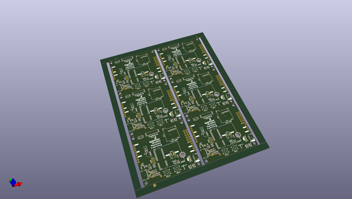
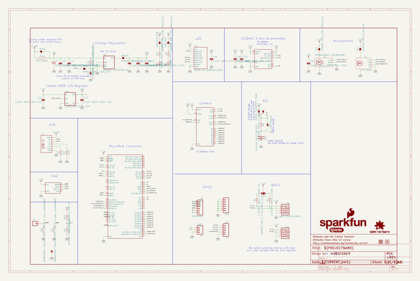
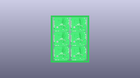
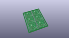
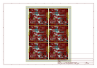
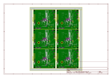
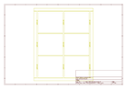
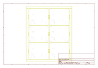
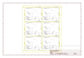

# OOMP Project  
## MicroMod_Machine_Learning_Carrier  by sparkfun  
  
(snippet of original readme)  
  
SparkFun MicroMod Machine Learning Carrier Board  
========================================  
  
  
  
[*SparkFun MicroMod Machine Learning Carrier Board (16400)*](https://www.sparkfun.com/products/16400)  
  
  
The MicroMod Machine Learning Carrier Board combines some of the features of our SparkFun Edge Board and SparkFun Artemis boards, but allows you the freedom to explore with any processor in the MicroMod lineup without the need for a central computer or web connection. Voice recognition, always-on voice commands, gesture, or image recognition are possible with TensorFlow applications. The cloud is impressively powerful but all-the-time connection requires power and connectivity that may not be available. Edge computing handles discrete tasks such as determining if someone said "yes" and responds accordingly. The audio analysis is done on the MicroMod combination rather than on the web. This dramatically reduces costs and complexity while limiting potential data privacy leaks.   
  
This board features two MEMS microphones with an operational amplifier, an ST LIS2DH12 3-axis accelerometer on its own I2C bus, a connector to interface to an OV7670 camera (sold separately), and Qwiic connector. A modern USB-C connector makes programming easy and we've exposed the JTAG connector for more advanced users who prefer to use   
  full source readme at [readme_src.md](readme_src.md)  
  
source repo at: [https://github.com/sparkfun/MicroMod_Machine_Learning_Carrier](https://github.com/sparkfun/MicroMod_Machine_Learning_Carrier)  
## Board  
  
  
## Schematic  
  
  
  
[schematic pdf](working_schematic.pdf)  
## Images  
  
  
  
  
  
  
  
  
  
  
  
  
  
  
  
  
