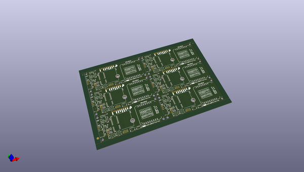
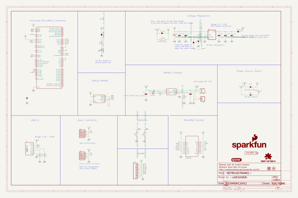

# OOMP Project  
## MicroMod_mikroBUS_Carrier_Board  by sparkfun  
  
(snippet of original readme)  
  
MicroMod mikroBUS™ Carrier Board  
========================================  
  
  
  
[*SparkFun MicroMod mikroBUS™ Carrier Board (DEV-18710)*](https://www.sparkfun.com/products/18710)  
  
The SparkFun MicroMod mikroBUS Carrier Board takes advantage of the [MicroMod](https://www.sparkfun.com/micromod), [Qwiic](https://www.sparkfun.com/qwiic), and [mikroBUS™](https://www.mikroe.com/mikrobus) ecosystems and allows users to take advantage of the growing number of 7 [MicroMod processor boards](https://www.sparkfun.com/categories/tags/processor-board), 83 [Qwiic *(add-on)* boards](https://www.sparkfun.com/categories/tags/qwiic), and [1079 available](https://www.mikroe.com/click-boards) [Click boards™](https://www.sparkfun.com/categories/tags/click) *(as of September 2021)*, which equates to +51M different board combinations.  
  
The mikroBUS socket comprises a pair of 8-pin female headers with a standardized pin configuration. The pins consist of three groups of communications pins (SPI, UART and I2C), six additional pins (PWM, Interrupt, Analog input, Reset and Chip select), and two power groups (3.3V and 5V).  
  
_The [mikroBUS™ standard](https://www.mikroe.com/mikrobus) was developed by [MikroElektronika](https://www.mikroe.com/). Similar to our [Qwiic](https://www.sparkfun.com/qwiic) and  
  full source readme at [readme_src.md](readme_src.md)  
  
source repo at: [https://github.com/sparkfun/MicroMod_mikroBUS_Carrier_Board](https://github.com/sparkfun/MicroMod_mikroBUS_Carrier_Board)  
## Board  
  
  
## Schematic  
  
  
  
[schematic pdf](working_schematic.pdf)  
## Images  
