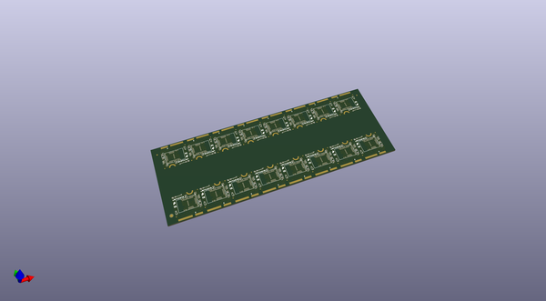
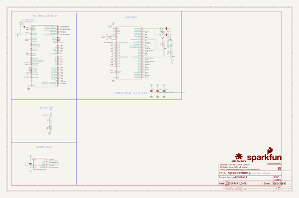

# OOMP Project  
## MicroMod_Processor_Board-nRF52840  by sparkfun  
  
(snippet of original readme)  
  
SparkFun MicroMod Processor - nRF52840  
========================================  
  
  
  
[*SparkFun MicroMod Processor - nRF52840 (DEV-16984)*](https://www.sparkfun.com/products/16984)  
  
Featuring the nRF52840 SoC from Nordic Semiconductor, the SparkFun MicroMod nRF52840 Processor offers a powerful combination of ARM Cortex-M4 CPU and 2.4 GHz Bluetooth transceiver in the MicroMod form-factor with the M.2 MicroMod connector to allow you to plug in a compatible MicroMod Carrier Board in the [MicroMod Ecosystem](https://www.sparkfun.com/micromod).   
  
The nRF52840 module includes a BT 5.1 stack and supports Bluetooth 5, Bluetooth mesh, IEEE 802.15.4 (Zigbee & Thread) and 2.4Ghz RF wireless protocols (including Nordic's proprietary RF protocol) allowing you to pick which option works best for your application.   
  
Repository Contents  
-------------------  
  
* **/Hardware** - Eagle design files (.brd, .sch)  
* **/SF_MM_nRF52840_PB** - Board variant files for Arduino mbed Core.  
* **/TestSketches** - Related software for the MicroMod nRF52840 Processor  
  
Documentation  
--------------  
  
* **[Hookup Guide](https://learn.sparkfun.com/tutorials/micromod-nrf52840-processor-hookup-guide)** - Basic hookup guide for the MicroMod Processor - nRF52840.  
* **[Getting Started with MicroMod](https://learn.sparkfun.com/tutorials/gettin  
  full source readme at [readme_src.md](readme_src.md)  
  
source repo at: [https://github.com/sparkfun/MicroMod_Processor_Board-nRF52840](https://github.com/sparkfun/MicroMod_Processor_Board-nRF52840)  
## Board  
  
  
## Schematic  
  
  
  
[schematic pdf](working_schematic.pdf)  
## Images  
