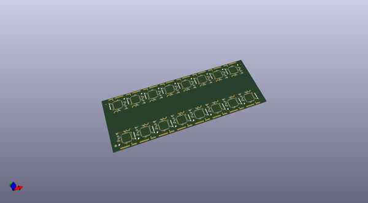
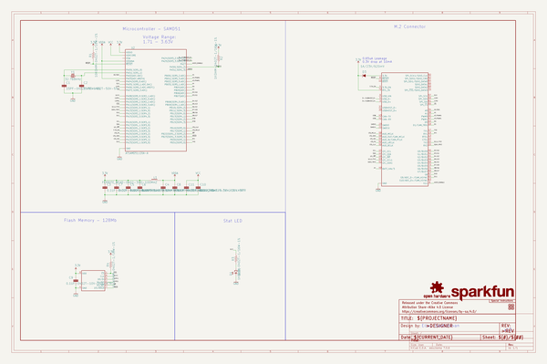

# OOMP Project  
## MicroMod_Processor_Board-SAMD51  by sparkfun  
  
(snippet of original readme)  
  
SparkFun MicroMod SAMD51 Processor  
========================================  
  
  
  
  
[*SparkFun MicroMod SAMD51 Processor (DEV-16791)*](https://www.sparkfun.com/products/16791)  
  
With a 32-bit ARM Cortex-M4F MCU, the SparkFun MicroMod SAMD51 Processor Board is one powerful microcontroller packaged on a small board! The provides you with an economical and easy to use development platform if you're needing more power with minimal working space. This MicroMod SAMD51 even comes flashed with the same convenient UF2 bootloader like the SAMD51 Thing Plus and the RedBoard Turbo. The MicroMod SAMD51 uses the MicroMod Hardware pinout to easily switch between carrier boards.  
  
The ATSAMD51J20 utilizes a 32-bit ARM Cortex-M4 processor with Floating Point Unit (FPU), running up to 120MHz, up to 1MB of flash memory, up to 256KB of SRAM with ECC, up to 6 SERCOM interfaces, and other features.  
  
Repository Contents  
-------------------  
  
* **/Arduino Board Files** - Board definitions for MicroMod SAMD51  
* **/Documentation** - Datasheets, additional product information  
* **/Hardware** - Eagle design files (.brd, .sch)  
* **/Production** - Production panel files (.brd)  
* **/uf2-bootloader** - Default firmware  
  
Documentation  
--------------  
* **[Graphical Datasheet](https://github.com/sparkfun/Graphical_Datasheets/tree/  
  full source readme at [readme_src.md](readme_src.md)  
  
source repo at: [https://github.com/sparkfun/MicroMod_Processor_Board-SAMD51](https://github.com/sparkfun/MicroMod_Processor_Board-SAMD51)  
## Board  
  
  
## Schematic  
  
  
  
[schematic pdf](working_schematic.pdf)  
## Images  
