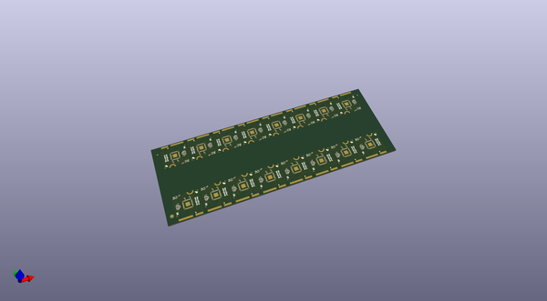
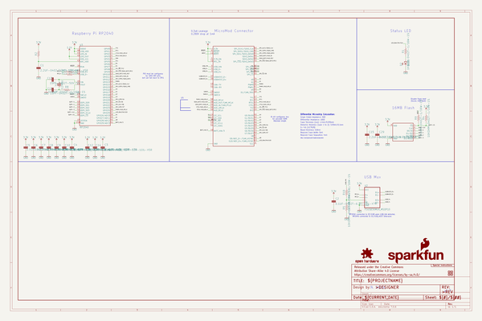
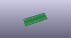
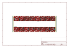
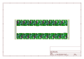
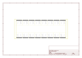
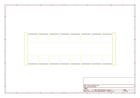
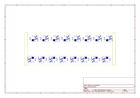
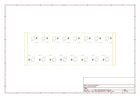

# OOMP Project  
## MicroMod_Processor-RP2040  by sparkfun  
  
(snippet of original readme)  
  
SparkFun MicroMod Processor RP2040  
========================================  
  
  
  
[*SparkFun MicroMod Processor RP2040 (DEV-17720)*](https://www.sparkfun.com/products/17720)  
  
The SparkFun MicroMod Pi RP2040 Processor Board is a low-cost, high-performance board with flexible digital interfaces featuring the Raspberry Pi Foundation's RP2040 microcontroller. With the MicroMod M.2 connector, connecting your MicroMod Pi RP2040 Processor Board is a breeze. Simply match up the key on your processor's beveled edge connector to the key on the M.2 connector and secure it with a screw (included with all Carrier Boards).  
  
Repository Contents  
-------------------  
  
* **/Documentation** - Data sheets, additional product information  
* **/Hardware** - Eagle design files (.brd, .sch)  
  
Documentation  
--------------  
  
* **[Hookup Guide](https://learn.sparkfun.com/tutorials/1495)** - Basic hookup guide for the MicroMod Processor RP2040  
* **[SparkFun Graphical Datasheets](https://github.com/sparkfun/Graphical_Datasheets)** - Graphical datasheets for various SparkFun products.  
  
Product Versions  
----------------  
  
* [DEV-17720](https://www.sparkfun.com/products/17720) -  initial release  
  
License Information  
-------------------  
  
This product is _**open source**_!   
  
Please review the LICENSE.md file for license information.   
  
If you  
  full source readme at [readme_src.md](readme_src.md)  
  
source repo at: [https://github.com/sparkfun/MicroMod_Processor-RP2040](https://github.com/sparkfun/MicroMod_Processor-RP2040)  
## Board  
  
  
## Schematic  
  
  
  
[schematic pdf](working_schematic.pdf)  
## Images  
  
  
  
  
  
  
  
  
  
  
  
  
  
  
  
  
