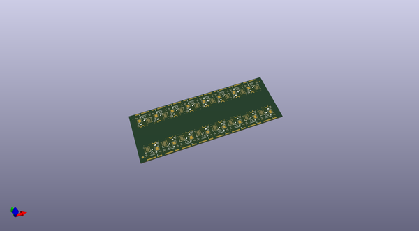
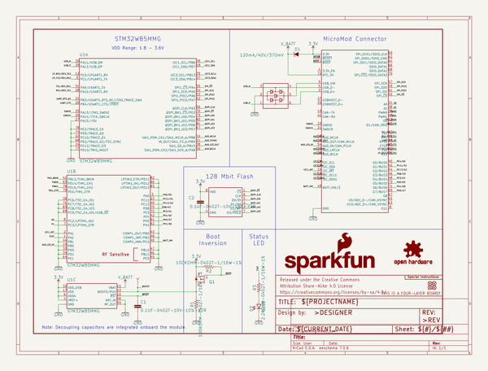

# OOMP Project  
## MicroMod_Processor_STM32WB5MMG  by sparkfun  
  
(snippet of original readme)  
  
SparkFun MicroMod Processor Board - STM32WB5MMG   
========================================  
  
  
  
[*MicroMod Processor Board - STM32WB5MMG (DEV-21438)*](https://www.sparkfun.com/products/21438)  
  
The MicroMod STM32WB5MMG Processor expands on SparkFun&apos;s MicroMod ST product line with a powerful combination of computing and wireless capabilities all on one Processor. The STM32WB5MMG from STMicroelectronics&trade; is an ultra-low power microcontroller that combines a pair of Arm&reg; Cortex&reg; processors; a Cortex-M4 processor for primary computing and a Cortex-M0 to run the 2.4 GHz radio. The radio is Bluetooth&reg; Low Energy 5.3, Zigbee&reg; 3.0, and OpenThread certified.  
  
Repository Contents  
-------------------  
  
* **/Documentation** - Data sheets, additional product information  
* **/Firmware** - Example code   
* **/Hardware** - Eagle design files (.brd, .sch)  
* **/Production** - Production panel files (.brd)  
  
  
Documentation  
--------------  
* **[Hookup Guide](https://learn.sparkfun.com/tutorials/micromod-stm32wb5mmg-hookup-guide)** - Basic hookup guide for the MicroMod Processor Board - STM32WB5MMG .  
* **[SparkFun Fritzing repo](https://github.com/sparkfun/Fritzing_Parts)** - Fritzing diagrams for SparkFun products.  
* **[SparkFun Graphical Datasheets](https://git  
  full source readme at [readme_src.md](readme_src.md)  
  
source repo at: [https://github.com/sparkfun/MicroMod_Processor_STM32WB5MMG](https://github.com/sparkfun/MicroMod_Processor_STM32WB5MMG)  
## Board  
  
  
## Schematic  
  
  
  
[schematic pdf](working_schematic.pdf)  
## Images  
  
  
  
  
  
  
  
  
  
  
  
  
  
  
  
  
