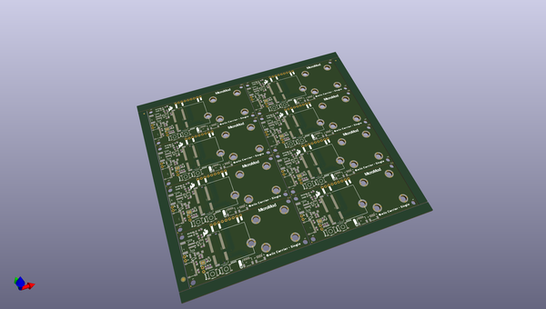
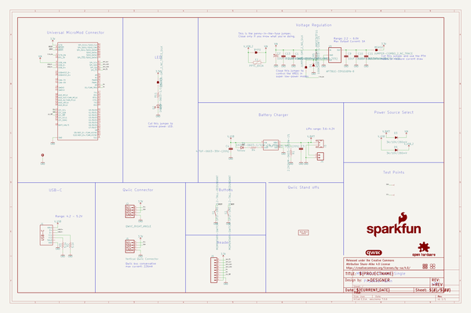
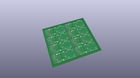
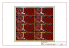
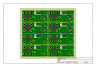
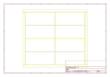
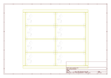
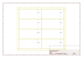
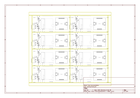

# OOMP Project  
## MicroMod_Qwiic_Carrier  by sparkfun  
  
(snippet of original readme)  
  
SparkFun MicroMod Qwiic Carrier Board  
========================================  
  
<table class="table table-hover table-striped table-bordered">  
    <tr align="center">  
      <td></td>  
      <td></td>  
    </tr>  
    <tr align="center">  
      <td><a href="https://www.sparkfun.com/products/17723">SparkFun Qwiic Carrier - Single</a></td>  
      <td><a href="https://www.sparkfun.com/products/17724">SparkFun Qwiic Carrier - Double</a></td>  
    </tr>  
</table>  
  
The MicroMod Qwiic Carrier Board for the [SparkFun MicroMod Ecosystem](https://www.sparkfun.com/micromod) can be used to rapidly prototype with other Qwiic devices. The MicroMod M.2 socket provides users the freedom to experiment with any processor board in the MicroMod ecosystem. This board also features two Qwiic connectors and 4-40 screw inserts to connect and mount Qwiic devices.  
  
Repository Contents  
-------------------  
* **/Hardware** - Eagle design files (.brd, .sch)  
  
Documentation  
--------------  
* **[Hookup Guide](https://learn.sparkfun.com/tutorials/1596)** - Basic hookup guide for the MicroMod Qwiic Carrier Board.  
  
Product Versions  
----------------  
* [DEV-17723](https://www.sparkfu  
  full source readme at [readme_src.md](readme_src.md)  
  
source repo at: [https://github.com/sparkfun/MicroMod_Qwiic_Carrier](https://github.com/sparkfun/MicroMod_Qwiic_Carrier)  
## Board  
  
  
## Schematic  
  
  
  
[schematic pdf](working_schematic.pdf)  
## Images  
  
  
  
  
  
  
  
  
  
  
  
  
  
  
  
  
