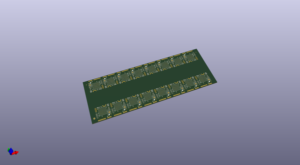
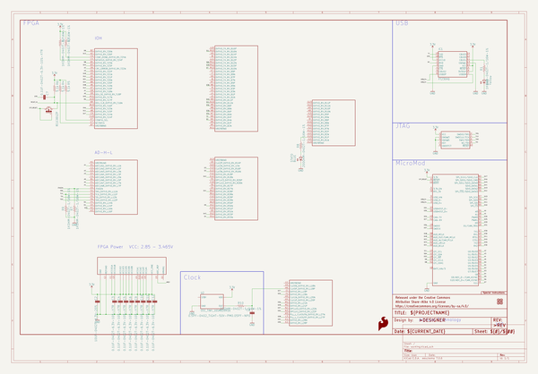

# OOMP Project  
## MicroMod_Sno_Processor_Board  by sparkfun  
  
oomp key: oomp_projects_flat_sparkfun_micromod_sno_processor_board  
(snippet of original readme)  
  
SparkFun MicroMod Alorium Sno M2 Processor Board  
========================================  
  
  
  
[*SparkFun MicroMod Alorium Sno M2 Processor Board (18030)*](https://www.sparkfun.com/products/18030)  
  
The [MicroMod Alorium Sno M2 Processor Board](https://www.sparkfun.com/products/18030) features the Snō System on Module (SoM) from Alorium Technology adapted to the MicroMod M.2 processor form factor. Snō's FPGA provides a reconfigurable hardware platform that hosts an 8-bit AVR instruction set, compatible with the ATmega328, making Snō fully compatible with the Arduino IDE. Snō SoM has a compact footprint, making it ideal for space-constrained applications and an obvious addition to our MicroMod form factor for prototyping.   
  
Alorium Technology provides a library of custom logic called Xcelerator Blocks (XBs) through the Arduino IDE that accelerate specific functionality that is slow, problematic, or even impossible for an 8-bit microcontroller. This library includes XBs such as Servo Control, Quadrature, Floating Point Math, NeoPixel, and Enhanced Analog-to-Digital Converter. Alorium also notes a XB roadmap where future XBs will be implemented based on feedback  
from early adopters and new potential customers.   
  
  
Repository Contents  
-------------------  
  
* **/Hardware** - Eagle design files (.br  
  full source readme at [readme_src.md](readme_src.md)  
  
source repo at: [https://github.com/sparkfun/MicroMod_Sno_Processor_Board](https://github.com/sparkfun/MicroMod_Sno_Processor_Board)  
## Board  
  
  
## Schematic  
  
  
  
[schematic pdf](working_schematic.pdf)  
## Images  
