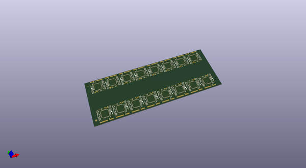
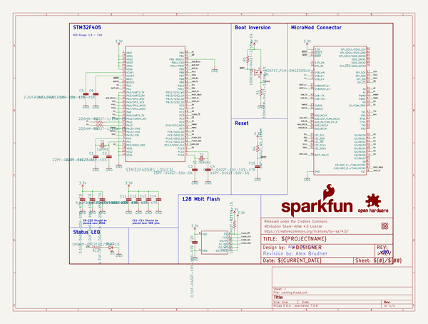

# OOMP Project  
## MicroMod_STM32_Processor  by sparkfun  
  
oomp key: oomp_projects_flat_sparkfun_micromod_stm32_processor  
(snippet of original readme)  
  
SparkFun STM32 MicroMod Processor  
========================================  
  
  
  
[*SparkFun STM32 MicroMod Processor v20 (21326)*](https://www.sparkfun.com/products/21326)  
  
We've brought the power and precision of the STM32 Processor to the [SparkFun MicroMod ecosystem](https://www.sparkfun.com/micromod)! Please welcome the [MicroMod STM32 Processor Board](https://www.sparkfun.com/products/21326)! With the high-performance Arm® Cortex®-M4 32-bit RISC core, Flash memory up to 1 Mbyte, up to 192 Kbytes of SRAM, a memory protection unit (MPU), high-speed embedded memories, up to 4 Kbytes of backup SRAM, and an extensive range of enhanced I/Os and peripherals, this board is chock full of functionality.   
  
Repository Contents  
-------------------  
  
* **/Hardware** - Eagle design files (.brd, .sch)  
* **/Production** - Production panel files (.brd)  
  
Documentation  
--------------  
* **[Hookup Guide](https://learn.sparkfun.com/tutorials/micromod-stm32-processor-hookup-guide)** - Basic hookup guide for the MicroMod STM32 Processor Board.  
* **[Getting Started with MicroMod](https://learn.sparkfun.com/tutorials/getting-started-with-micromod)** - A tutorial to help you get started with the MicroMod Ecosystem.   
* **[Designing with MicroMod](https://learn.sparkfun.com/tutorials/designing-with-micromod)** - A tutorial to walk you through the specs of the MicroMod processor and carrier board as well  
  full source readme at [readme_src.md](readme_src.md)  
  
source repo at: [https://github.com/sparkfun/MicroMod_STM32_Processor](https://github.com/sparkfun/MicroMod_STM32_Processor)  
## Board  
  
  
## Schematic  
  
  
  
[schematic pdf](working_schematic.pdf)  
## Images  
