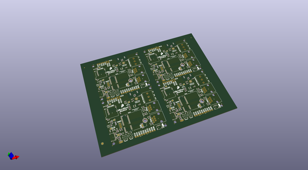
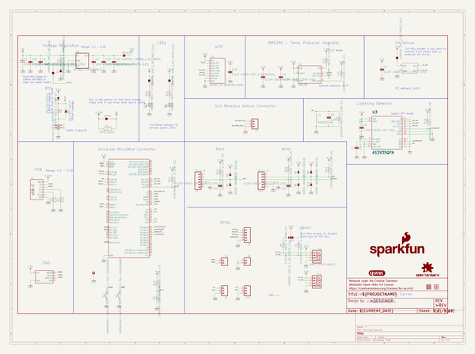
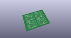
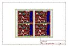
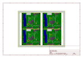
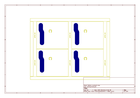
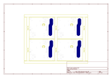
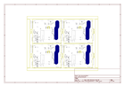

# OOMP Project  
## MicroMod_Weather_Carrier_Board  by sparkfun  
  
oomp key: oomp_projects_flat_sparkfun_micromod_weather_carrier_board  
(snippet of original readme)  
  
SparkFun MicroMod Weather Carrier Board  
========================================  
  
  
  
[*SparkFun MicroMod Weather Carrier Board (SEN-16794)*](https://www.sparkfun.com/products/16794)  
  
The MicroMod Weather Carrier Board for the [SparkFun MicroMod Ecosystem](https://www.sparkfun.com/micromod) allows you to create your own weather station with one of a multitude of processors. The carrier board includes three sensors: the BME280 temperature, pressure and humidity sensor, the VEML6075 UV sensor and the AS3935 Lightning detector. There is also a 3-pin latch terminal to add an external [soil moisture sensor](https://www.sparkfun.com/products/13637), a pair RJ11 jacks to plug in the wind and rain sensors included with our [Weather Meter Kit](https://www.sparkfun.com/products/15901) as well as a microSD card slot so you can plug in an SD card to log the weather data.  
  
Repository Contents  
-------------------  
  
* **/Documentation** - Data sheets, additional product information   
* **/Hardware** - Eagle design files (.brd, .sch)  
* **/Production** - Production panel files (.brd)  
* **/Examples** - Arduino examples for the MicroMod Weather Carrier Board  
  
Documentation  
--------------  
* **Libraries** - Arduino libraries required for the MicroMod Weather Carrier Board.  
   * **[BME280 Library](https://github.com/sparkfun/SparkFun_BME280_Arduino_Library)**  
  full source readme at [readme_src.md](readme_src.md)  
  
source repo at: [https://github.com/sparkfun/MicroMod_Weather_Carrier_Board](https://github.com/sparkfun/MicroMod_Weather_Carrier_Board)  
## Board  
  
  
## Schematic  
  
  
  
[schematic pdf](working_schematic.pdf)  
## Images  
  
  
  
  
  
  
  
  
  
  
  
  
  
  
  
  
