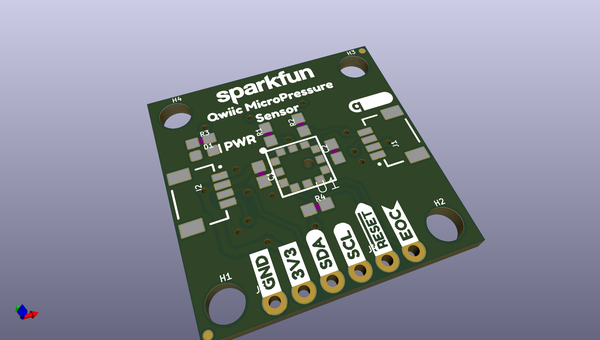
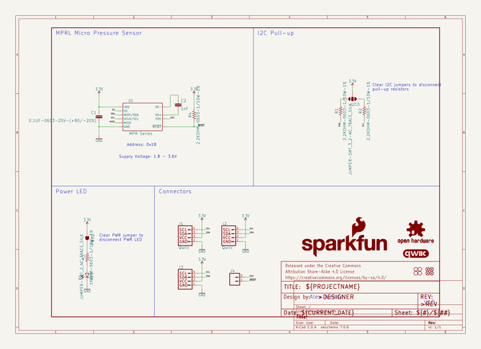
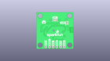
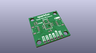
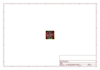
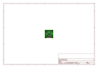
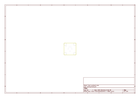
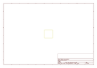
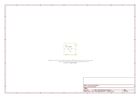

# OOMP Project  
## MicroPressure_Sensor  by sparkfun  
  
oomp key: oomp_projects_flat_sparkfun_micropressure_sensor  
(snippet of original readme)  
  
- SparkFun MicroPressure Sensor  
  
========================================  
  
  
  
[*SparkFun MicroPressure Sensor (16476)*](https://www.sparkfun.com/products/16476)  
  
<Basic description of the part.>  
  
Repository Contents  
-------------------  
  
* **/Documentation** - Data sheets, additional product information  
* **/Hardware** - Eagle design files (.brd, .sch)  
* **/Libraries** - Libraries for use with the <PRODUCT NAME>  
* **/Production** - Production panel files (.brd)  
* **/Software** - Related software for the <PRODUCT NAME>  
  
Documentation  
-------------  
* **[Library](https://github.com/sparkfun/SparkFun_MicroPressure_Arduino_Library)** - Arduino library for the SparkFun MicroPressure Sensor.  
* **[Hookup Guide](https://learn.sparkfun.com/tutorials/sparkfun-qwiic-micropressure-hookup-guide)** - Basic hookup guide for the SparkFun Qwiic MicroPressure Sensor.  
  
License Information  
-------------------  
  
This product is _**open source**_!   
  
Please review the LICENSE.md file for license information.   
  
If you have any questions or concerns on licensing, please contact technical support on our [SparkFun forums](https://forum.sparkfun.com/viewforum.php?f=152).  
  
Distributed as-is; no warranty is given.  
  
- Your friends at SparkFun.  
  
_<COLLABORATION CREDIT>_  
  
  full source readme at [readme_src.md](readme_src.md)  
  
source repo at: [https://github.com/sparkfun/MicroPressure_Sensor](https://github.com/sparkfun/MicroPressure_Sensor)  
## Board  
  
  
## Schematic  
  
  
  
[schematic pdf](working_schematic.pdf)  
## Images  
  
  
  
  
  
  
  
  
  
  
  
  
  
  
  
  
