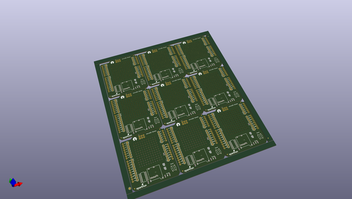
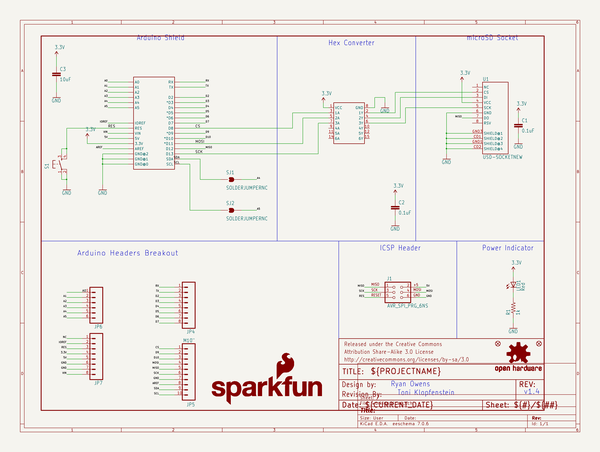
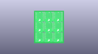
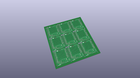
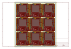
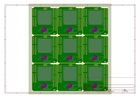
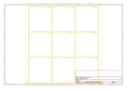
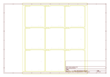
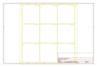
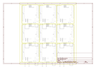

# OOMP Project  
## microSD_Shield  by sparkfun  
  
(snippet of original readme)  
  
SparkFun microSD Shield  
===========================  
  
  
  
[*microSD Shield (DEV-12761)*](https://www.sparkfun.com/products/12761)  
  
The microSD shield equips your Arduino with mass-storage capability, so you can use it for data-logging or other related projects.   
  
Repository Contents  
-------------------  
  
* **/Firmware** - Example .INO sketch for Arduino. Requires the SD.h library  
* **/Hardware** - All Eagle design files (.brd, .sch)  
* **/Production** - Test bed files and production panel files  
  
Documentation  
--------------  
* **[Hookup Guide](https://learn.sparkfun.com/tutorials/microsd-shield-and-sd-breakout-hookup-guide)** - Basic hookup guide for the microSD Shield.  
* **[SparkFun Fritzing repo](https://github.com/sparkfun/Fritzing_Parts)** - Fritzing diagrams for SparkFun products.  
* **[SparkFun 3D Model repo](https://github.com/sparkfun/3D_Models)** - 3D models of SparkFun products.   
  
Product Versions  
----------------  
* [DEV-09802](https://www.sparkfun.com/products/9802)- Hardware version 1.3. Designed for Uno (not R3)  
  
Version History  
---------------  
* [v1.3](https://github.com/sparkfun/microSD_Shield/tree/V_1.3) Version 1.3  
  
  
License Information  
-------------------  
  
This product is _**open source**_!   
  
Please review the LICENSE.md file for license information.   
  
If you have any questions or concerns on licensing, please contact techsupport@sparkfun.com.  
  
Distributed as-is; no warranty is given.  
  
-   
  full source readme at [readme_src.md](readme_src.md)  
  
source repo at: [https://github.com/sparkfun/microSD_Shield](https://github.com/sparkfun/microSD_Shield)  
## Board  
  
  
## Schematic  
  
  
  
[schematic pdf](working_schematic.pdf)  
## Images  
  
  
  
  
  
  
  
  
  
  
  
  
  
  
  
  
