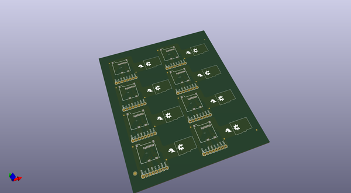
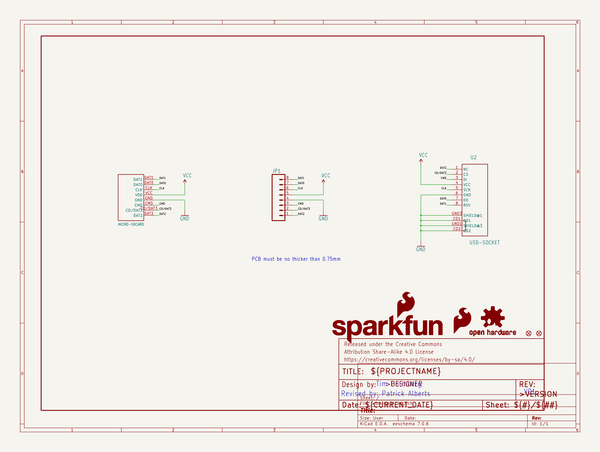
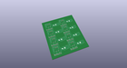
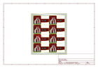
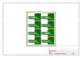
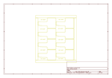
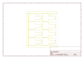
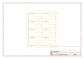

# OOMP Project  
## MicroSD_Sniffer  by sparkfun  
  
(snippet of original readme)  
  
SparkFun microSD Sniffer  
=========================  
  
  
  
  
[*SparkFun microSD Sniffer (TOL-09419)*](https://www.sparkfun.com/products/9419)  
  
  
Repository Contents  
-------------------  
* **/Hardware** - Eagle design files (.brd, .sch)  
* **/Production** - Production panel files (.brd)  
  
Documentation  
--------------  
* **[Hookup Guide](https://learn.sparkfun.com/tutorials/microsd-sniffer-hookup-guide)** - Basic hookup guide for the microSD Sniffer.  
  
  
Product Versions  
----------------  
* [TOL-09419](https://www.sparkfun.com/products/9419)- Version 10  
  
License Information  
-------------------  
  
This product is _**open source**_!   
  
Please review the LICENSE.md file for license information.   
  
If you have any questions or concerns on licensing, please contact techsupport@sparkfun.com.  
  
Distributed as-is; no warranty is given.  
  
- Your friends at SparkFun.  
  
  full source readme at [readme_src.md](readme_src.md)  
  
source repo at: [https://github.com/sparkfun/MicroSD_Sniffer](https://github.com/sparkfun/MicroSD_Sniffer)  
## Board  
  
  
## Schematic  
  
  
  
[schematic pdf](working_schematic.pdf)  
## Images  
  
  
  
  
  
  
  
  
  
  
  
  
  
  
  
  
