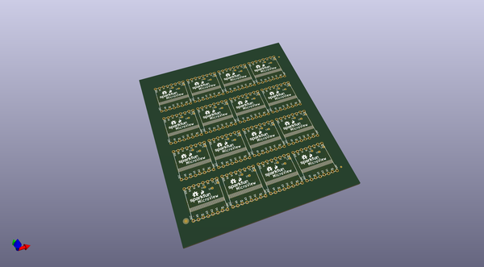
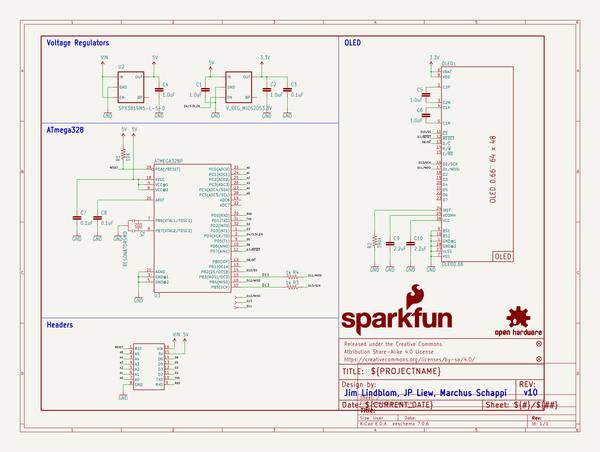

# OOMP Project  
## MicroView  by sparkfun  
  
(snippet of original readme)  
  
MicroView  
=============  
  
  
  
[*SparkFun Microview (DEV-12923)*](https://www.sparkfun.com/products/12923)  
  
The MicroView is a chip-sized Arduino with a built-in OLED. Compatible with the MicroView USB Programmer linked below.   
  
Repository Contents  
-------------------  
* **/Datasheets** - Datasheets for the OLED module  
* **/Enclosure** - 3D model of the standard Microview Enclosure  
* **/Hardware** - All Eagle design files (.brd, .sch)  
* **/Libraries** - All Arduino libraries and board examples  
* **/Production** - Test bed files and production panel files  
  
Product Versions  
----------------  
* [DEV-12923](https://www.sparkfun.com/products/12923)- Version 1.0  
* [DEV-12924](https://www.sparkfun.com/products/12924)- MicroView USB Programmer version 0.2  
  
License Information  
-------------------  
The hardware is released under [Creative Commons ShareAlike 4.0 International](https://creativecommons.org/licenses/by-sa/4.0/).  
The code is beerware; if you see me (or any other SparkFun employee) at the local, and you've found our code helpful, please buy us a round!  
  
Distributed as-is; no warranty is given.  
  
  full source readme at [readme_src.md](readme_src.md)  
  
source repo at: [https://github.com/sparkfun/MicroView](https://github.com/sparkfun/MicroView)  
## Board  
  
  
## Schematic  
  
  
  
[schematic pdf](working_schematic.pdf)  
## Images  
