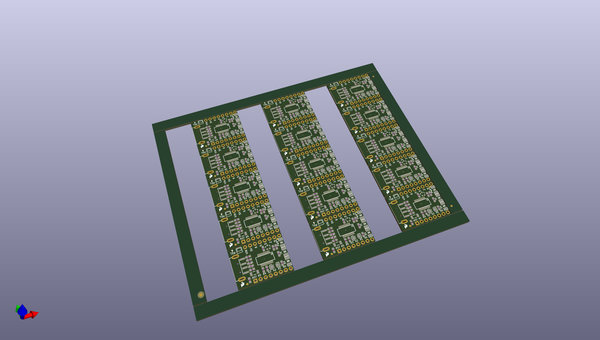

# OOMP Project  
## MicroView_USB_Programmer  by sparkfun  
  
oomp key: oomp_projects_flat_sparkfun_microview_usb_programmer  
(snippet of original readme)  
  
SparkFun MicroView USB Programmer  
=================================  
  
  
  
[*SparkFUn MicroView USB Programmer (DEV-12924)*](https://www.sparkfun.com/products/12924)  
  
This USB programmer connects directly to the MicroView   
and lets you not only program the module, but use it   
to interface with your computer, Rapsberry Pi, or other USB device.  
  
  
Repository Contents  
-------------------  
  
* **/Hardware** - All Eagle design files (.brd, .sch, .STL)  
* **/Production** - Test bed files and production panel files  
  
Product Versions  
----------------  
* [DEV-12924](https://www.sparkfun.com/products/12924)- MicroView USB Programmer version 0.2  
* [DEV-12923](https://www.sparkfun.com/products/12923)- MicroView version 1.0  
  
  
License Information  
-------------------  
The hardware is released under [Creative Commons ShareAlike 4.0 International](https://creativecommons.org/licenses/by-sa/4.0/).  
  
Distributed as-is; no warranty is given.  
  
  full source readme at [readme_src.md](readme_src.md)  
  
source repo at: [https://github.com/sparkfun/MicroView_USB_Programmer](https://github.com/sparkfun/MicroView_USB_Programmer)  
## Board  
  
  
## Schematic  
  
  
  
[schematic pdf](working_schematic.pdf)  
## Images  
