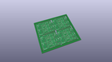
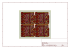
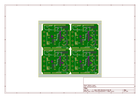
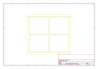
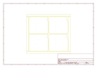
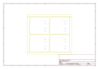
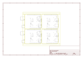

# OOMP Project  
## MIDI_Shield  by sparkfun  
  
(snippet of original readme)  
  
SparkFun MIDI Shield  
====================  
  
  
  
[*SparkFun MIDI Shield (DEV-12898)*](https://www.sparkfun.com/products/12898)  
  
The MIDI Shield gives your Arduino access to the MIDI communication protocol, so you can control synthesizers, sequencers, and other musical devices.  
  
Repository Contents  
-------------------  
  
* **/Firmware** - Example Arduino .ino sketch  
* **/Hardware** - All Eagle design files (.brd, .sch)  
* **/Production** - Production panel files (.brd)  
  
Documentation  
--------------  
* **[Hookup Guide](https://learn.sparkfun.com/tutorials/midi-shield-hookup-guide?_ga=1.24780723.863167751.1453149924)** - Basic hookup guide for the MIDI Shield.  
* **[SparkFun Fritzing repo](https://github.com/sparkfun/Fritzing_Parts)** - Fritzing diagrams for SparkFun products.  
* **[SparkFun 3D Model repo](https://github.com/sparkfun/3D_Models)** - 3D models of SparkFun products.   
* **[SparkFun Graphical Datasheets](https://github.com/sparkfun/Graphical_Datasheets)** -Graphical Datasheets for various SparkFun products.  
  
Product Versions  
----------------  
* [DEV-12898](https://www.sparkfun.com/products/12898)- Version 1.5. R3 compatible. Currently live.   
* [DEV-09595](https://www.sparkfun.com/products/retired/9595)- Version 1.3. Retired.   
  
Version History  
---------------  
* [V_1.5](https://github.com/sparkfun/MIDI_Shield/tree/V_1.5) - GitHub snapshot at V_1.5.   
* [V_  
  full source readme at [readme_src.md](readme_src.md)  
  
source repo at: [https://github.com/sparkfun/MIDI_Shield](https://github.com/sparkfun/MIDI_Shield)  
## Board  
  
  
## Schematic  
  
  
  
[schematic pdf](working_schematic.pdf)  
## Images  
  
  
  
  
  
  
  
  
  
  
  
  
  
  
  
  
