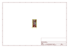
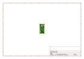
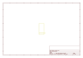
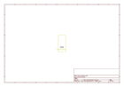
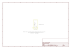

# OOMP Project  
## Mini_GPS_Shield  by sparkfun  
  
oomp key: oomp_projects_flat_sparkfun_mini_gps_shield  
(snippet of original readme)  
  
SparkFun Mini GPS Shield  
=============================================  
  
  
  
[*SparkFun Mini GPS Shield (GPS-14030)*](https://www.sparkfun.com/products/14030)  
  
The [SparkFun Mini GPS Shield](https://www.sparkfun.com/products/14030) equips your Arduino with access to a GPS module, µSD memory card socket, and all of the other peripherals you'll need to turn your Arduino into a position-tracking, speed-monitoring, altitude-observing wonder logger. The shield is based around the [GP-735](https://www.sparkfun.com/products/13670) GPS Module -- a 56-channel GPS receiver featuring a uBlox 7th generation chipset and an up to 10Hz update rate.  
   
 Repository Contents  
-------------------  
* **/Hardware** - All Eagle design files (.brd, .sch)  
  
Documentation  
-------------------  
* [**Hookup Guide**](https://learn.sparkfun.com/tutorials/wireless-joystick-hookup-guide)  
  
  
License Information  
-------------------  
The hardware is released under [Creative Commons ShareAlike 4.0 International](https://creativecommons.org/licenses/by-sa/4.0/).  
The code is beerware; if you see me (or any other SparkFun employee) at the local, and you've found our code helpful, please buy us a round!  
  full source readme at [readme_src.md](readme_src.md)  
  
source repo at: [https://github.com/sparkfun/Mini_GPS_Shield](https://github.com/sparkfun/Mini_GPS_Shield)  
## Board  
  
  
## Schematic  
  
  
  
[schematic pdf](working_schematic.pdf)  
## Images  
  
  
  
  
  
  
  
  
  
  
  
  
  
  
  
  
