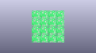
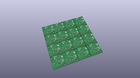
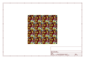
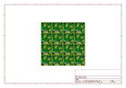
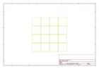
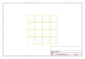
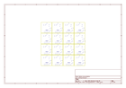
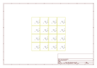

# OOMP Project  
## MiniMoto  by sparkfun  
  
oomp key: oomp_projects_flat_sparkfun_minimoto  
(snippet of original readme)  
  
**NOTE:** *This product has been retired from our catalog. If you are looking for more up-to-date info, please check out some of these resources to see how other users are still hacking and improving on this product.*  
* *[SparkFun Forum](https://forum.sparkfun.com/)*  
* *[Comments Here on GitHub](https://github.com/sparkfun/MiniMoto/issues)*  
* *[IRC Channel](https://www.sparkfun.com/news/263)*  
  
SparkFun MiniMoto Breakout - DRV8830  
=========================================  
  
  
  
[*SparkFun MiniMoto Breakout - DRV8830(BOB-11890)*](https://www.sparkfun.com/products/11890)  
  
The MiniMoto is a breakout board for the DRV8830 I2C DC motor driver. It operates between 2.7V to 6.8V  
  
Repository Contents  
-------------------  
* **/Hardware** - All Eagle design files (.brd, .sch)  
* **/Libraries** - All Arduino libraries and board examples  
* **/Production** - Test bed files and production panel files  
  
Documentation  
--------------  
* **[Library](https://github.com/sparkfun/SparkFun_MiniMoto_Arduino_Library)** - Arduinolibrary for the MiniMoto.  
* **[Hookup Guide](https://learn.sparkfun.com/tutorials/minimoto-drv8830-hookup-guide)** - Basic hookup guide for the MiniMoto.  
* **[SparkFun Fritzing repo](https://github.com/sparkfun/Fritzing_Parts)** - Fritzing diagrams for SparkFun products.  
* **[SparkFun 3D Model repo](https://github.com/sparkfun/3D_Models)** - 3D models o  
  full source readme at [readme_src.md](readme_src.md)  
  
source repo at: [https://github.com/sparkfun/MiniMoto](https://github.com/sparkfun/MiniMoto)  
## Board  
  
  
## Schematic  
  
  
  
[schematic pdf](working_schematic.pdf)  
## Images  
  
  
  
  
  
  
  
  
  
  
  
  
  
  
  
  
