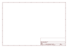
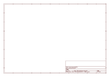

# OOMP Project  
## MMA8452_Accelerometer  by sparkfun  
  
oomp key: oomp_projects_flat_sparkfun_mma8452_accelerometer  
(snippet of original readme)  
  
SparkFun Triple Axis Accelerometer Breakout - MMA8452Q  
=============================================  
  
<table class="table table-hover table-striped table-bordered">  
  <tr align="center">  
   <td></td>  
   <td></td>  
  </tr>  
  <tr align="center">  
    <td>SparkFun Triple Axis Accelerometer Breakout - MMA8452Q [<a href="https://www.sparkfun.com/products/12756">SEN-12756</a>]</td>  
    <td>SparkFun Triple Axis Accelerometer Breakout - MMA8452Q (with Headers)  
[<a href="https://www.sparkfun.com/products/13926">BOB-13926</a>]</td>  
  </tr>  
</table>  
  
This breakout board makes it easy to use the tiny MMA8452Q accelerometer in your project.   
The MMA8452Q is a smart low-power, three-axis, capacitive micro-machined accelerometer with 12 bits of resolution.  
  
Repository Contents  
-------------------  
* **/Firmware** - Example Arduino sketches for interfacing with the accelerometer  
* **/Hardware** - All Eagle design files (.brd, .sch)  
* **/Libraries** - Libraries for use with the accelerometer  
* **/Production** - Production panel files (.brd)  
  
Documentation  
-------------  
  full source readme at [readme_src.md](readme_src.md)  
  
source repo at: [https://github.com/sparkfun/MMA8452_Accelerometer](https://github.com/sparkfun/MMA8452_Accelerometer)  
## Board  
  
  
## Schematic  
  
  
  
[schematic pdf](working_schematic.pdf)  
## Images  
  
  
  
  
  
  
  
  
  
  
  
  
  
  
  
  
