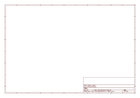
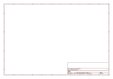

# OOMP Project  
## Monster_Moto_Shield  by sparkfun  
  
(snippet of original readme)  
  
Monster Moto Shield  
===================  
  
  
  
This motor shield contains a pair of VNH2SP30 full-bridge motor drivers, pitched for the 5mm screw terminals.   
  
Features  
-------------------  
* Voltage max: 16V  
* Maximum current rating: 30 A  
* Practical Continuous Current: 14 A  
* Current sensing available to Arduino analog pin  
* MOSFET on-resistance: 19 mΩ (per leg)  
* Maximum PWM frequency: 20 kHz  
* Thermal Shutdown  
* Undervoltage and Overvoltage shutdown  
  
  
Repository Contents  
-------------------  
* **/Firmware** - Example Arduino sketch   
* **/Hardware** - All Eagle design files (.brd, .sch)  
<!--- * **/Production** - Test bed files and production panel files  
This folder doesn't actually resist, so I removed it from the README. --->  
  
  
License Information  
-------------------  
The hardware is released under [Creative Commons ShareAlike 4.0 International](https://creativecommons.org/licenses/by-sa/4.0/).  
The code is beerware; if you see the authors (or any SparkFun employee) at the local, and you've found our code helpful, please buy us a round!  
  
Distributed as-is; no warranty is given.  
  
  full source readme at [readme_src.md](readme_src.md)  
  
source repo at: [https://github.com/sparkfun/Monster_Moto_Shield](https://github.com/sparkfun/Monster_Moto_Shield)  
## Board  
  
  
## Schematic  
  
  
  
[schematic pdf](working_schematic.pdf)  
## Images  
  
  
  
  
  
  
  
  
  
  
  
  
  
  
  
  
