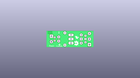
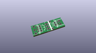
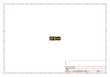
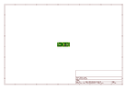
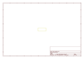
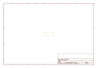
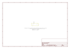

# OOMP Project  
## MOSFET_Power_Control_Kit  by sparkfun  
  
(snippet of original readme)  
  
SparkFun MOSFET Power Control Kit  
===================================  
  
  
  
[*SparkFun MOSFET Power Control Kit (COM-12959)*](https://www.sparkfun.com/products/12959)  
  
This is the SparkFun MOSFET Power Control Kit, a breakout PTH soldering kit for for the RFP30N06LE N-Channel MOSFET.  
What we really like about this particular MOSFET is that it’s very common and offers very low on-resistance with a control   
(gate) voltage that is compatible with any 3-5V microcontroller or mechanical switch. This allows you to control high-power  
 devices with very low-power control mechanisms.  
   
 Repository Contents  
-------------------  
* **/Hardware** - All Eagle design files (.brd, .sch)  
  
Product Versions  
----------------  
* [COM-10256](https://www.sparkfun.com/products/retired/10256)- Version 1.0. Retired.   
  
License Information  
-------------------  
The hardware is released under [Creative Commons ShareAlike 4.0 International](https://creativecommons.org/licenses/by-sa/4.0/).  
  
Distributed as-is; no warranty is given.  
  
  full source readme at [readme_src.md](readme_src.md)  
  
source repo at: [https://github.com/sparkfun/MOSFET_Power_Control_Kit](https://github.com/sparkfun/MOSFET_Power_Control_Kit)  
## Board  
  
  
## Schematic  
  
  
  
[schematic pdf](working_schematic.pdf)  
## Images  
  
  
  
  
  
  
  
  
  
  
  
  
  
  
  
  
