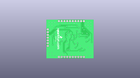
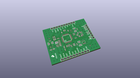
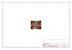
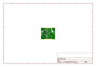
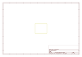
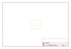
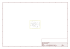

# OOMP Project  
## MP3_Breakout-VS1063  by sparkfun  
  
(snippet of original readme)  
  
SparkFun MP3 Breakout - VS1063  
========================================  
  
  
  
[*SparkFun MP3 Breakout - VS1063 (BOB-11684)*](https://www.sparkfun.com/products/11684)  
  
VS1063 is an easy-to-use, versatile encoder, decoder and codec for a multitude of audio formats.   
With this breakout board, it’s easy to drop it into any project.   
The VS1063 is capable of decoding Ogg Vorbis/MP3/AAC/WMA audio and encoding MP3, IMA ADPCM and user-loadable Ogg Vorbis.   
This breakout can also drive 30 ohm headphones with no additional power supply.  
  
Repository Contents  
-------------------  
  
* **/Firmware** - Example code   
* **/Hardware** - Eagle design files (.brd, .sch)  
* **/Production** - Production panel files (.brd)  
  
Documentation  
--------------  
* **[SparkFun Fritzing repo](https://github.com/sparkfun/Fritzing_Parts)** - Fritzing diagrams for SparkFun products.  
* **[SparkFun 3D Model repo](https://github.com/sparkfun/3D_Models)** - 3D models of SparkFun products.   
  
License Information  
-------------------  
This product is _**open source**_!   
  
The **hardware** is released under [Creative Commons ShareAlike 4.0 International](https://creativecommons.org/licenses/by-sa/4.0/).  
  
The **code** is beerware; if you see me (or any other SparkFun employee) at the local, and you've found our code helpful, please buy us a round!  
  
Please use, reuse, and modify these files as you see fit. Please maintain attribution to Sp  
  full source readme at [readme_src.md](readme_src.md)  
  
source repo at: [https://github.com/sparkfun/MP3_Breakout-VS1063](https://github.com/sparkfun/MP3_Breakout-VS1063)  
## Board  
  
  
## Schematic  
  
  
  
[schematic pdf](working_schematic.pdf)  
## Images  
  
  
  
  
  
  
  
  
  
  
  
  
  
  
  
  
