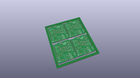
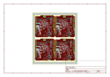
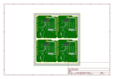
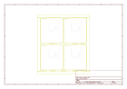
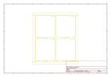
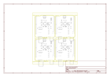

# OOMP Project  
## MP3_Player_Shield  by sparkfun  
  
oomp key: oomp_projects_flat_sparkfun_mp3_player_shield  
(snippet of original readme)  
  
SparkFun MP3 Player Shield  
==========================  
  
    
  
[*SparkFun MP3 Player Shield (DEV-2660)*](https://www.sparkfun.com/products/12660)  
  
The MP3 Player Shield has a microSD socket, VS1053 decoder IC and all the supporting circuitry to be able to decode and play MP3s from an Arduino.  
  
Repository Contents  
-------------------  
  
* **/Documentation** - Data sheets, additional product information  
* **/Firmware** - Multiple examples of how to read MP3 files and send them to the VS1053.  
* **/Hardware** - All Eagle design files (.brd, .sch)  
* **/Production** - Production panel files (.brd)  
  
Documentation  
--------------  
* **[Hookup Guide](https://learn.sparkfun.com/tutorials/mp3-player-shield-hookup-guide-v15)** - Basic hookup guide for the Mp3 Shield.  
* **[SparkFun Fritzing repo](https://github.com/sparkfun/Fritzing_Parts)** - Fritzing diagrams for SparkFun products.  
* **[SparkFun 3D Model repo](https://github.com/sparkfun/3D_Models)** - 3D models of SparkFun products.   
  
Product Versions  
----------------  
* [DEV-09736](https://www.sparkfun.com/products/retired/9736)- Version 1.0. Retired.   
* [DEV-10628](https://www.sparkfun.com/products/retired/10628)- Version 1.3. Retired.   
* [DEV-12660](https://www.sparkfun.com/products/12660) - Version 1.5. Current.   
  
Version History  
---------------  
* [v1.3](https://github.com/sparkfun/MP3_Player_Shield/tree/V_1.3) - Version 1.3 GitHub files. Retired.   
*   
  full source readme at [readme_src.md](readme_src.md)  
  
source repo at: [https://github.com/sparkfun/MP3_Player_Shield](https://github.com/sparkfun/MP3_Player_Shield)  
## Board  
  
  
## Schematic  
  
  
  
[schematic pdf](working_schematic.pdf)  
## Images  
  
  
  
  
  
  
  
  
  
  
  
  
  
  
  
  
