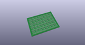
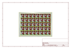
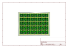
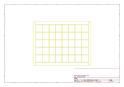
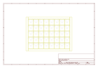
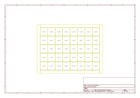

# OOMP Project  
## MPL3115A2_Breakout  by sparkfun  
  
(snippet of original readme)  
  
SparkFun MPL3115A2 Altitude/Pressure Sensor Breakout  
====================================================  
  
[    
*MPL3115A2 Altitude/Pressure Sensor Breakout (SEN-11084)*](https://www.sparkfun.com/products/11084)  
  
The MPL3115A2 is a MEMS pressure sensor that provides Altitude data to within 30cm (with oversampling enabled). The sensor outputs are digitized by a high resolution 24-bit ADC and transmitted over I2C, meaning it's easy to interface with most controllers.  
  
Repository Contents  
-------------------  
* **/Firmware** - Example Arduino sketch to use with the sensor.  
* **/Hardware** - All Eagle design files (.brd, .sch)  
* **/Libraries** - All Arduino libraries  
  
Documentation  
--------------  
* **[Library](https://github.com/sparkfun/SparkFun_MPL3115A2_Breakout_Arduino_Library)** - Arduino library for the MPL3115A2.  
* **[Hookup Guide](https://learn.sparkfun.com/tutorials/mpl3115a2-pressure-sensor-hookup-guide)** - Basic hookup guide for the MPL3115A2 Breakout.  
* **[SparkFun Fritzing repo](https://github.com/sparkfun/Fritzing_Parts)** - Fritzing diagrams for SparkFun products.  
* **[SparkFun 3D Model repo](https://github.com/sparkfun/3D_Models)** - 3D models of SparkFun products.   
  
License Information  
-------------------  
The hardware is released under [Creative Commons ShareAlike 4.0 International](https://creativecommons.org/licenses/by-sa/4.0/).  
The   
  full source readme at [readme_src.md](readme_src.md)  
  
source repo at: [https://github.com/sparkfun/MPL3115A2_Breakout](https://github.com/sparkfun/MPL3115A2_Breakout)  
## Board  
  
  
## Schematic  
  
  
  
[schematic pdf](working_schematic.pdf)  
## Images  
  
  
  
  
  
  
  
  
  
  
  
  
  
  
  
  
