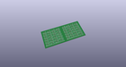
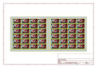
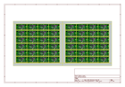
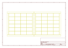
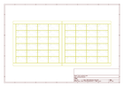
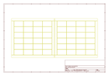
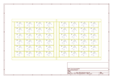

# OOMP Project  
## MPU-6050_Breakout  by sparkfun  
  
oomp key: oomp_projects_flat_sparkfun_mpu_6050_breakout  
(snippet of original readme)  
  
Triple Axis Accelerometer & Gyro Breakout - MPU-6050  
====================================================  
[    
*Triple Axis Accelerometer & Gyro Breakout-MPU-6050 (SEN-11028)*](https://www.sparkfun.com/products/11028)  
  
The MPU-6050 combines a 3-axis MEMS gyroscope and 3-axis accelerometer onto a single IC. Our breakout board  
allows I2C access for the data from these sensors.   
  
Repository Contents  
-------------------  
* **/Hardware** - All Eagle design files (.brd, .sch)  
* **/Production** - Test bed files and production panel files  
  
License Information  
-------------------  
The hardware is released under [Creative Commons Share-alike 3.0](http://creativecommons.org/licenses/by-sa/3.0/).    
  
  full source readme at [readme_src.md](readme_src.md)  
  
source repo at: [https://github.com/sparkfun/MPU-6050_Breakout](https://github.com/sparkfun/MPU-6050_Breakout)  
## Board  
  
  
## Schematic  
  
  
  
[schematic pdf](working_schematic.pdf)  
## Images  
  
  
  
  
  
  
  
  
  
  
  
  
  
  
  
  
