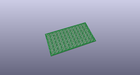
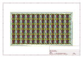
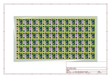
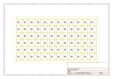
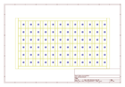
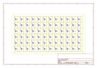

# OOMP Project  
## MPU-9250_Breakout  by sparkfun  
  
oomp key: oomp_projects_flat_sparkfun_mpu_9250_breakout  
(snippet of original readme)  
  
9 Degrees of Freedom - MPU-9250 Breakout  
========================================  
  
  
  
[*9 Degrees of Freedom - MPU-9250 Breakout (SEN-13762)*](https://www.sparkfun.com/products/13762)  
  
The MPU-9250 is an accelerometer, gyro, and magnetometer all in a single package with an I2C. [The datasheet can be found here.](https://cdn.sparkfun.com/assets/learn_tutorials/5/5/0/MPU9250REV1.0.pdf)  
  
There are two SparkFun Arduino libraries available for this sensor:  
  
* [SparkFun MPU-9250 Breakout Library](https://github.com/sparkfun/SparkFun_MPU-9250_Breakout_Arduino_Library) -- Simple Arduino library that supports all accelerometer, gyroscope, and magnetometer reads from the MPU-9250.  
* [SparkFun MPU-9250 Digital Motion Processing (DMP) Arduino Library](https://github.com/sparkfun/SparkFun_MPU-9250-DMP_Arduino_Library) -- More advanced library that includes support for the MPU-9250's digital motion processing (DMP) library. This provides support for features like tap-detection, orientation-detection, step-counting (pedometer), and quaternion-calculation. Only tested on ARM-based Arduino boards ([SparkFun SAMD21 Mini Breakout](https://www.sparkfun.com/products/13664), [SparkFun 9DoF Razor - M0](https://www.sparkfun.com/products/14001)  
  
Repository Contents  
-------------------  
  
* **/Firmware** &mdash; An Arduino library with an example that sends raw sensor data, quaternions, an  
  full source readme at [readme_src.md](readme_src.md)  
  
source repo at: [https://github.com/sparkfun/MPU-9250_Breakout](https://github.com/sparkfun/MPU-9250_Breakout)  
## Board  
  
  
## Schematic  
  
  
  
[schematic pdf](working_schematic.pdf)  
## Images  
  
  
  
  
  
  
  
  
  
  
  
  
  
  
  
  
