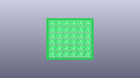
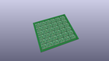
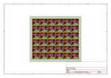
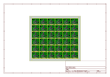
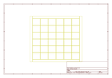
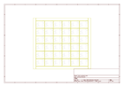
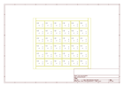

# OOMP Project  
## MS5803-14BA_Breakout  by sparkfun  
  
(snippet of original readme)  
  
SparkFun Pressure Sensor Breakout - MS5803-14BA  
====================  
  
  
  
[*SparkFun Pressure Sensor Breakout - MS5803-14BA (SEN-12909)*](https://www.sparkfun.com/products/12909)  
  
The MS58XX, MS57XX, and MS56XX by Measurement Specialties is a low cost I2C pressure  
sensor.  This sensor can be used in weather stations and for altitude  
estimations. It can also be used underwater for water depth measurements.  
  
This part was created in Eagle v6.5.0.  
  
Repository Contents  
-------------------  
  
* **/Hardware** - All Eagle design files (.brd, .sch)  
* **/Libraries** - All Arduino libraries and board examples  
* **/Production** - production panel files  
  
Documentation  
--------------  
* **[Library](https://github.com/sparkfun/SparkFun_MS5803-14BA_Breakout_Arduino_Library)** - Arduino library for the pressure sensor.  
* **[Hookup Guide](https://learn.sparkfun.com/tutorials/ms5803-14ba-pressure-sensor-hookup-guide)** - Basic hookup guide for the pressure sensor.  
* **[SparkFun Fritzing repo](https://github.com/sparkfun/Fritzing_Parts)** - Fritzing diagrams for SparkFun products.  
* **[SparkFun 3D Model repo](https://github.com/sparkfun/3D_Models)** - 3D models of SparkFun products.  
  
Version History  
---------------  
* [V_H1.0](https://github.com/sparkfun/MS5803-14BA_Breakout/tree/V_H1.0) &mdash; Removing o  
  full source readme at [readme_src.md](readme_src.md)  
  
source repo at: [https://github.com/sparkfun/MS5803-14BA_Breakout](https://github.com/sparkfun/MS5803-14BA_Breakout)  
## Board  
  
  
## Schematic  
  
  
  
[schematic pdf](working_schematic.pdf)  
## Images  
  
  
  
  
  
  
  
  
  
  
  
  
  
  
  
  
