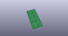
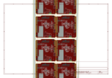
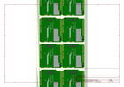
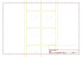
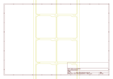
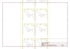

# OOMP Project  
## Music_Instrument_Shield  by sparkfun  
  
(snippet of original readme)  
  
SparkFun Music Instrument Shield  
========================================  
  
  
  
[*SparkFun Music Instrument Shield (DEV-10587)*](https://www.sparkfun.com/products/10587)  
  
The SparkFun Musical Instrument Shield is an easy way to add great sounding MIDI sound to your next Arduino project.   
This board is built around the VS1053 MP3 and MIDI codec IC, wired in MIDI mode.   
Simply connect a speaker/stereo/pair of headphones to the 1/8" stereo jack on the shield and pass the proper serial commands to the IC and you’ll be playing music in no time!  
  
Repository Contents  
-------------------  
  
* **/Firmware** - Example code   
* **/Hardware** - Eagle design files (.brd, .sch)  
* **/Production** - Production panel files (.brd)  
  
Documentation  
--------------  
* **[Hookup Guide](https://www.sparkfun.com/tutorials/302)** - Basic hookup guide for the Music Instrument Shield.  
* **[SparkFun Fritzing repo](https://github.com/sparkfun/Fritzing_Parts)** - Fritzing diagrams for SparkFun products.  
* **[SparkFun 3D Model repo](https://github.com/sparkfun/3D_Models)** - 3D models of SparkFun products.   
  
License Information  
-------------------  
This product is _**open source**_!   
  
The **hardware** is released under [Creative Commons ShareAlike 4.0 International](https://creativecommons.org/licenses/by-sa/4.0/).  
  
The **code** is beerware; if you see me (or any other SparkFun employee) at the local, and you've found ou  
  full source readme at [readme_src.md](readme_src.md)  
  
source repo at: [https://github.com/sparkfun/Music_Instrument_Shield](https://github.com/sparkfun/Music_Instrument_Shield)  
## Board  
  
  
## Schematic  
  
  
  
[schematic pdf](working_schematic.pdf)  
## Images  
  
  
  
  
  
  
  
  
  
  
  
  
  
  
  
  
