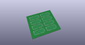
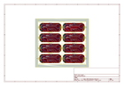
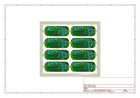
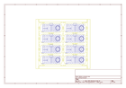
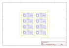
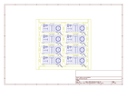
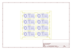

# OOMP Project  
## MyoWare_LED_Shield  by sparkfun  
  
(snippet of original readme)  
  
MyoWare™ LED Shield  
========================================  
  
  
  
[*MyoWare LED Shield (13688)*](https://www.sparkfun.com/products/13688)  
  
The MyoWare™ LED Shield is designed to pair with the MyoWare™ Muscle Sensor. The 10 segment bar graph shows the magnitude of the measured signal.  
  
Repository Contents  
-------------------  
  
* **/Hardware** - Eagle design files (.brd, .sch)  
  
Documentation  
--------------  
* **[Hookup Guide](https://learn.sparkfun.com/tutorials/myoware-muscle-sensor-kit?_ga=1.172011619.1515819426.1457626448)** - Basic hookup guide for the MyoWare™ LED Shield.  
* **[SparkFun Fritzing repo](https://github.com/sparkfun/Fritzing_Parts)** - Fritzing diagrams for SparkFun products.  
* **[SparkFun 3D Model repo](https://github.com/sparkfun/3D_Models)** - 3D models of SparkFun products.  
  
License Information  
-------------------  
  
This product is _**open source**_!  
  
Please review the LICENSE.md file for license information.  
  
If you have any questions or concerns on licensing, please contact techsupport@sparkfun.com.  
  
Distributed as-is; no warranty is given.  
  
- Your friends at SparkFun.  
  
  full source readme at [readme_src.md](readme_src.md)  
  
source repo at: [https://github.com/sparkfun/MyoWare_LED_Shield](https://github.com/sparkfun/MyoWare_LED_Shield)  
## Board  
  
  
## Schematic  
  
  
  
[schematic pdf](working_schematic.pdf)  
## Images  
  
  
  
  
  
  
  
  
  
  
  
  
  
  
  
  
